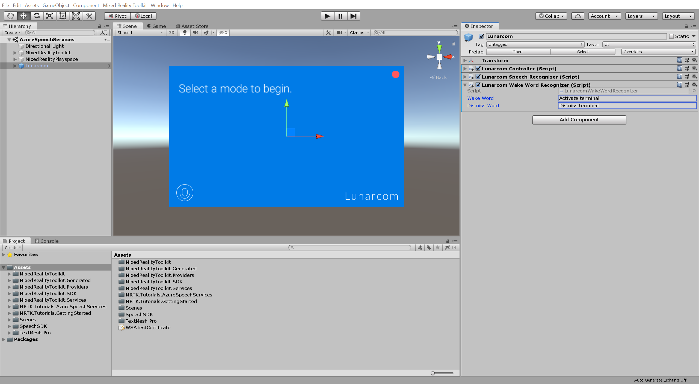
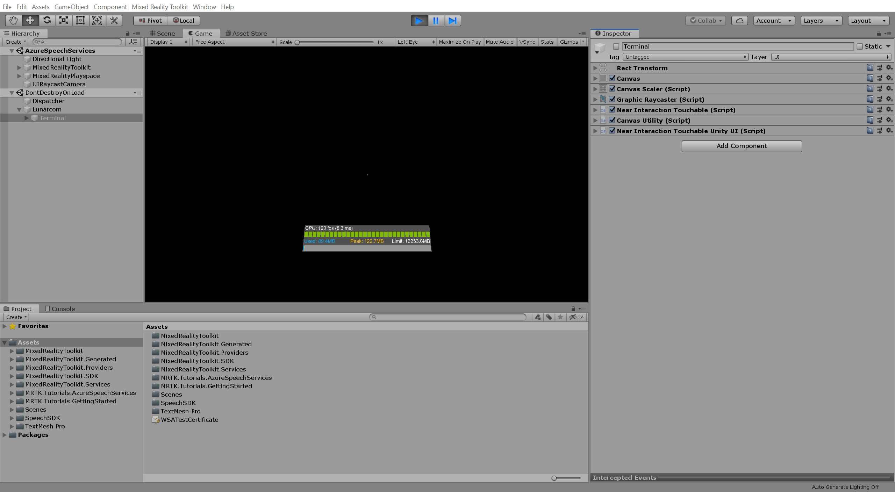
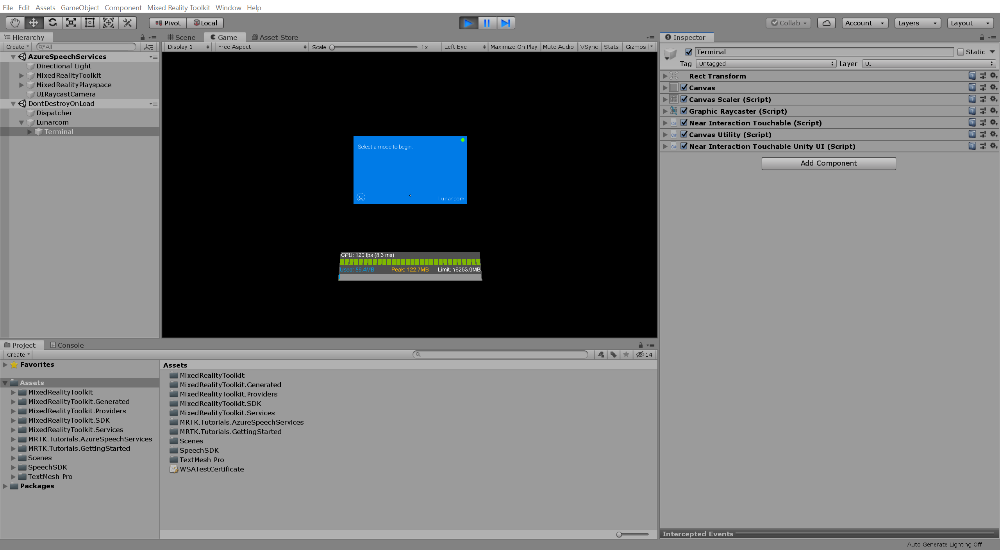

# 4. Exercise: Adding an offline mode for local speech-to-text translation
In this module, you will add the ability to execute commands using Azure speech recognition which will allow you to make something happen based on the word or phrase you define.

## Instructions

In the Hierarchy window, select the **Lunarcom** object, then in the Inspector window, use the **Add Component** button to add the **Lunarcom Wake Word Recognizer (Script)** component to the Lunarcom object and configure it as follows:

* In the **Wake Word** field, enter a suitable phrase, for example, _Activate terminal_.
* In the **Dismiss Word** field, enter a suitable phrase, for example, _Dismiss terminal_.

> [!NOTE]
> The Lunarcom Wake Word Recognizer (Script) component is not part of MRTK. It was provided with this tutorial's assets.

If you now enter Game mode, as in the previous tutorial, the terminal panel is enabled by default, but you can now disable it by saying the Dismiss Word, **Dismiss terminal**:

And enable it again by saying the Wake Word, **Activate terminal**:

> [!CAUTION]
> The application needs to connect to Azure, so make sure your computer/device is connected to the internet.

> [!TIP]
> If you anticipate frequently not being able to connect to Azure, you can also implement speech commands using MRTK by following the [Using speech commands](mr-learning-base-09.md) instructions.

