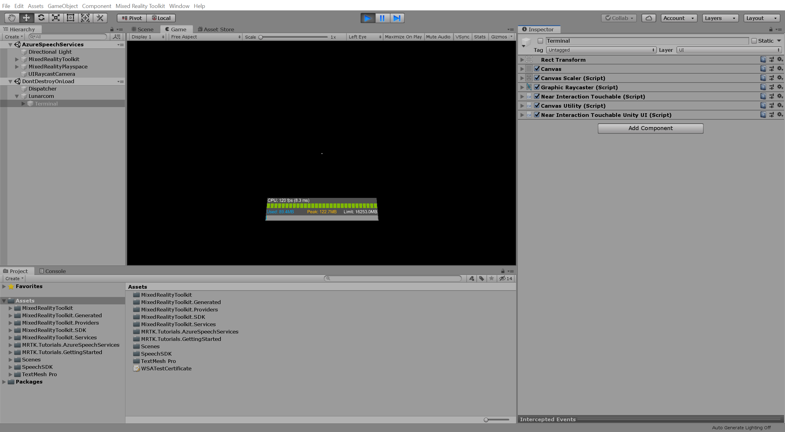
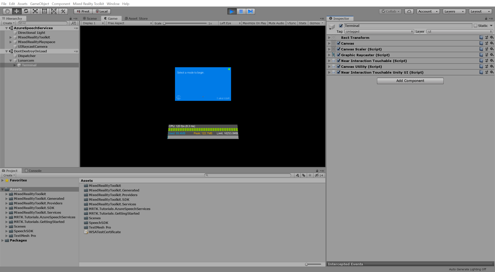

#  Azure Speech Services Tutorials

We will create a Mixed Reality application that explores the use of Azure Speech Services with the HoloLens 2. When we complete this module series, we will be able to use your device's microphone to transcribe speech to text in real time, translate our speech into other languages, and leverage the Intent recognition feature to understand voice commands using artificial intelligence.

## Learning Objectives

* Learn how to integrate Azure Speech Services with a HoloLens 2 application
* Learn how to use speech recognition to transcribe text
* Learn how Azure speech recognition can be used to execute commands
* Learn how to integrate Azure speech translation
* Learn how to set up intent, entities, and utterances in the LUIS portal
* Learn how to implement intent and natural language understanding in our application

## Prerequisites

* A Windows 10 PC configured with the correct [tools installed](../../install-the-tools.md)
* Windows 10 SDK 10.0.18362.0 or later
* Some basic C# programming ability
* A HoloLens 2 device [configured for development](../../platform-capabilities-and-apis/using-visual-studio.md#enabling-developer-mode)
* <a href="https://docs.unity3d.com/Manual/GettingStartedInstallingHub.html" target="_blank">Unity Hub</a> with Unity 2019 LTS installed and the Universal Windows Platform Build Support module added

## Modules
1. Integrating and using speech recognition and transcription
2. Exercise:Integrating and using speech recognition and transcription
3. Adding an offline mode for local speech to texy translation
4. Exercise:Adding an offline mode for local speech to texy translation
5. Adding the Azure Cognition Services speech translation component
6. Exercise:Adding the Azure Cognition Services speech translation component
7. Setting up intent and natural language understanding
8. Exercise:Setting up intent and natural language understanding
9. Knowledge Check
10. Summary
# 1. Integrating and using speech recognition and transcription
## Azure Speech Services
The Speech service is the unification of speech-to-text, text-to-speech, and speech-translation into a single Azure subscription. It's easy to speech enable your applications, tools, and devices with the Speech CLI, Speech SDK, Speech Devices SDK, Speech Studio, or REST APIs.
## Speech Recognition
The Speaker Recognition service provides algorithms that verify and identify speakers by their unique voice characteristics using voice biometry. It is used to answer the question “who is speaking?”. You provide audio training data for a single speaker, which creates an enrollment profile based on the unique characteristics of the speaker's voice. You can then cross-check audio voice samples against this profile to verify that the speaker is the same person (speaker verification), or cross-check audio voice samples against a group of enrolled speaker profiles, to see if it matches any profile in the group (speaker identification). In contrast, Speaker Diarization groups segments of audio by speaker in a batch operation.
## Transcription
It is a set of REST API operations that enable you to transcribe a large amount of audio in storage. You can point to audio files with a shared access signature (SAS) URI and asynchronously receive transcription results.
## MRTK Speech commands
Speech input providers, like Windows Speech Input, don't create any controllers but instead allow you to define keywords that will raise speech input events when recognized. The Speech Commands Profile in the Input System Profile is where you configure the keywords to recognize. For each command you can also:

Select an input action to map it to. This way you can for example use the keyword Select to have the same effect as a left mouse click, by mapping both to the same action.
Specify a key code that will produce the same speech event when pressed.
Add a localization key that will be used in UWP apps to obtain the localized keyword from the app resources.
## Speech SDK
The Speech software development kit (SDK) exposes many of the Speech service capabilities, to empower you to develop speech-enabled applications. The Speech SDK is available in many programming languages and across all platforms.The Speech SDK exposes many features from the Speech service, but not all of them. The capabilities of the Speech SDK are often associated with scenarios. The Speech SDK is ideal for both real-time and non-real-time scenarios, using local devices, files, Azure blob storage, and even input and output streams. When a scenario is not achievable with the Speech SDK, look for a REST API alternative.

## Spatial Perception
Provides programmatic access to spatial mapping data, giving mixed reality apps information about surfaces in application-specified regions of space near the user. Declare the spatialPerception capability only when your app will explicitly use these surface meshes, as the capability is not required for mixed reality apps to perform holographic rendering based on the user’s head pose.

## Internet Client server
It enables peer-to-peer (P2P) scenarios where the app needs to listen for incoming network connections.
## Private network client server
Provides inbound and outbound access to home and work networks through the firewall. This capability is typically used for games that communicate across the local area network (LAN), and for apps that share data across a variety of local devices.

# 2. Exercise: Integrating and using speech recognition and transcription

In this module, you will create a Mixed Reality application that explores the use of Azure Speech Services with the HoloLens 2. When you complete this series, you will be able to use your device's microphone to transcribe speech to text in real time, translate your speech into other languages, and leverage the Intent recognition feature to understand voice commands using artificial intelligence.

## Creating and preparing the Unity project

In this section, you will create a new Unity project and get it ready for MRTK development.

For this, first follow the [Initializing your project and first application](mr-learning-base-02.md), excluding the [Build your application to your device](mr-learning-base-02.md#building-your-application-to-your-hololens-2) instructions, which includes the following steps:

1. [Creating the Unity project](mr-learning-base-02.md#creating-the-unity-project) and give it a suitable name, for example, *MRTK Tutorials*
2. [Switching the build platform](mr-learning-base-02.md#configuring-the-unity-project)
3. [Importing the TextMeshPro Essential Resources](mr-learning-base-02.md#importing-the-textmeshpro-essential-resources)
4. [Importing the Mixed Reality Toolkit](mr-learning-base-02.md#importing-the-mixed-reality-toolkit)
5. [Configuring the Unity project](mr-learning-base-02.md#configuring-the-unity-project)
6. [Creating and configuring the scene](mr-learning-base-02.md#creating-and-configuring-the-scene) and give the scene a suitable name, for example, *AzureSpeechServices*

Then follow the [Changing the Spatial Awareness Display Option](mr-learning-base-03.md#changing-the-spatial-awareness-display-option) instructions to ensure the MRTK configuration profile for your scene is **DefaultHoloLens2ConfigurationProfile**  and change the display options for the spatial awareness mesh to **Occlusion**.

## Configuring the speech commands start behavior

Because you will use the Speech SDK for speech recognition and transcription you need to configure the MRTK Speech Commands so they do not interfere with the Speech SDK functionality. To achieve this you can change the speech commands start behavior from Auto Start to Manual Start.

With the **MixedRealityToolkit** object selected in the Hierarchy window, in the Inspector window, select the **Input** tab, clone the **DefaultHoloLens2InputSystemProfile** and the **DefaultMixedRealitySpeechCommandsProfile**, and then change the speech commands **Start Behavior** to **Manual Start**:

> [!TIP]
> For a reminder on how to import a Unity custom package, you can refer to the [Importing the tutorial assets](mr-learning-base-02.md#importing-the-tutorial-assets) instructions.

## Configuring the capabilities

In the Unity menu, select **Edit** > **Project Settings...** to open the Player Settings window, then locate the **Player** >  **Publishing Settings** section:

In the  **Publishing Settings**, scroll down to the **Capabilities** section and double-check that the **InternetClient**, **Microphone**, and **SpatialPerception** capabilities, which you enabled when you created the project at the beginning of the tutorial, are enabled. Then, enable the **InternetClientServer** and **PrivateNetworkClientServer** capabilities:

## Importing the tutorial assets

Download and **import** the following Unity custom packages **in the order they are listed**:

* [Microsoft.CognitiveServices.Speech.N.N.N.unitypackage](https://aka.ms/csspeech/unitypackage) (latest version)
* [MRTK.HoloLens2.Unity.Tutorials.Assets.GettingStarted.2.3.0.3.unitypackage](https://github.com/microsoft/MixedRealityLearning/releases/download/getting-started-v2.3.0.3/MRTK.HoloLens2.Unity.Tutorials.Assets.GettingStarted.2.3.0.3.unitypackage)
* [MRTK.HoloLens2.Unity.Tutorials.Assets.AzureSpeechServices.2.5.1.unitypackage](https://github.com/microsoft/MixedRealityLearning/releases/download/2.5.1/MRTK.HoloLens2.Unity.Tutorials.Assets.AzureSpeechServices.2.5.1.unitypackage)

> [!TIP]
> For a reminder on how to import a Unity custom package, you can refer to the [Importing the Mixed Reality Toolkit](mr-learning-base-02.md#importing-the-mixed-reality-toolkit) instructions.

After you have imported the tutorial assets your Project window should look similar to this:

## Preparing the scene

In this section, you will prepare the scene by adding the tutorial prefab and configure the Lunarcom Controller (Script) component to control your scene.

In the Project window, navigate to **Assets** > **MRTK.Tutorials.AzureSpeechServices** > **Prefabs** folder and drag the **Lunarcom** prefab into the Hierarchy window to add it to your scene:

With the **Lunarcom** object still selected in the Hierarchy window, in the Inspector window, use the **Add Component** button to add the **Lunarcom Controller (Script)** component to the Lunarcom object:

> [!NOTE]
> The Lunarcom Controller (Script) component is not part of MRTK. It was provided with this tutorial's assets.

With the **Lunarcom** object still selected, expand it to reveal its child objects, then drag the **Terminal** object into the Lunarcom Controller (Script) component's **Terminal** field:

With the **Lunarcom** object still selected, expand the Terminal object to reveal its child objects, then drag the **ConnectionLight** object into the Lunarcom Controller (Script) component's **Connection Light** field and the **OutputText** object into the **Output Text** field:

With the **Lunarcom** object still selected, expand the Buttons object to reveal its child objects, and then in the Inspector window, expand the **Buttons** list, set its **Size** to 3, and drag the **MicButton**, **SatelliteButton**, and **RocketButton** objects into the **Element** 0, 1, and 2 fields respectively:

## Connecting the Unity project to the Azure resource

To use Azure Speech Services, you need to create an Azure resource and obtain an API key for the Speech Service. Follow the [Try the Speech service for free](/azure/cognitive-services/speech-service/get-started) instructions and make a note of your service region (also known as Location) and API key (also known as Key1 or Key2).

In the Hierarchy window, select the **Lunarcom** object, then in the Inspector window, locate the **Lunarcom Controller (Script)** component's **Speech SDK Credentials** section and configure it as follows:

* In the **Speech Service API Key** field, enter your API key (Key1 or Key2)
* In the **Speech Service Region** field, enter your service region (Location) using lowercase letters and spaces removed

## Using speech recognition to transcribe speech

In the Hierarchy window, select the **Lunarcom** object, then in the Inspector window, use the **Add Component** button to add the **Lunarcom Speech Recognizer (Script)** component to the Lunarcom object:

> [!NOTE]
> The Lunarcom Speech Recognizer (Script) component is not part of MRTK. It was provided with this tutorial's assets.

If you now enter Game mode, you can test the speech recognition by first pressing the microphone button:

Then, assuming your computer has a microphone, when you say something, your speech will be transcribed on the terminal panel:

> [!CAUTION]
> The application needs to connect to Azure, so make sure your computer/device is connected to the internet.

# 3. Adding an offline mode for local speech-to-text translation
## Azure speech recognition can be used to execute commands
The Speech CLI is a command-line tool for using the Speech service without writing any code. The Speech CLI requires minimal setup, and it's easy to immediately start experimenting with key features of the Speech service to see if your use-cases can be met. Within minutes, you can run simple test workflows like batch speech-recognition from a directory of files, or text-to-speech on a collection of strings from a file. Beyond simple workflows, the Speech CLI is production-ready and can be scaled up to run larger processes using automated .bat or shell scripts.

Most features in the Speech SDK are available in the Speech CLI, and some advanced features and customizations are simplified in the Speech CLI. Consider the following guidance to decide when to use the Speech CLI or the Speech SDK.

Use the Speech CLI when:

You want to experiment with Speech service features with minimal setup and no code
You have relatively simple requirements for a production application using the Speech service
Use the Speech SDK when:

You want to integrate Speech service functionality within a specific language or platform (for example, C#, Python, C++)
You have complex requirements that may require advanced service requests, or developing custom behavior including response streaming.
# 4. Exercise: Adding an offline mode for local speech-to-text translation
In this module, you will add the ability to execute commands using Azure speech recognition which will allow you to make something happen based on the word or phrase you define.

## Instructions

In the Hierarchy window, select the **Lunarcom** object, then in the Inspector window, use the **Add Component** button to add the **Lunarcom Wake Word Recognizer (Script)** component to the Lunarcom object and configure it as follows:

* In the **Wake Word** field, enter a suitable phrase, for example, _Activate terminal_.
* In the **Dismiss Word** field, enter a suitable phrase, for example, _Dismiss terminal_.

> [!NOTE]
> The Lunarcom Wake Word Recognizer (Script) component is not part of MRTK. It was provided with this tutorial's assets.

If you now enter Game mode, as in the previous tutorial, the terminal panel is enabled by default, but you can now disable it by saying the Dismiss Word, **Dismiss terminal**:

And enable it again by saying the Wake Word, **Activate terminal**:

> [!CAUTION]
> The application needs to connect to Azure, so make sure your computer/device is connected to the internet.

> [!TIP]
> If you anticipate frequently not being able to connect to Azure, you can also implement speech commands using MRTK by following the [Using speech commands](mr-learning-base-09.md) instructions.

# 5. Adding the Azure Cognitive Services speech translation component
## Speech translation
Speech translation is the process by which conversational spoken phrases are instantly translated and spoken aloud in a second language. This differs from phrase translation, which is where the system only translates a fixed and finite set of phrases that have been manually entered into the system. Speech translation technology enables speakers of different languages to communicate. It thus is of tremendous value for humankind in terms of science, cross-cultural exchange and global business.
## Azure Cognitive Service
Cognitive Services brings AI within reach of every developer—without requiring machine-learning expertise. All it takes is an API call to embed the ability to see, hear, speak, search, understand and accelerate decision-making into your apps. Enable developers of all skill levels to easily add AI capabilities to their apps.
# 6. Exercise: Adding the Azure Cognitive Services speech translation component
In this module, you will add speech translation to your project which will allow you to translate and transcribed your speech into three different languages.

## Instructions

In the Hierarchy window, select the **Lunarcom** object, then in the Inspector window, use the **Add Component** button to add the **Lunarcom Translation Recognizer (Script)** component to the Lunarcom object and configure it as follows:

* Change the **Target Language** to a language of your choosing, for example, _German_

> [!NOTE]
> The Lunarcom Translation Recognizer (Script) component is not part of MRTK. It was provided with this tutorial's assets.

If you now enter Game mode, you can test the speech translation by first pressing the satellite button. Then, assuming your computer has a microphone, when you say something, your speech will be translated into the chosen language and transcribed on the terminal panel:

> [!CAUTION]
> The application needs to connect to Azure, so make sure your computer/device is connected to the internet.

# 7. Setting up intent and natural language understanding

## Natural language
Natural language processing (NLP) is a subfield of linguistics, computer science, and artificial intelligence concerned with the interactions between computers and human language, in particular how to program computers to process and analyze large amounts of natural language data. The result is a computer capable of "understanding" the contents of documents, including the contextual nuances of the language within them. The technology can then accurately extract information and insights contained in the documents as well as categorize and organize the documents themselves.

Challenges in natural language processing frequently involve speech recognition, natural language understanding, and natural-language generation.
## Azure prediction resource for the Language Understanding Intelligent Service (LUIS) app
Language Understanding (LUIS) is a cloud-based conversational AI service that applies custom machine-learning intelligence to a user's conversational, natural language text to predict overall meaning, and pull out relevant, detailed information. LUIS provides access through its custom portal, APIs and SDK client libraries.

## Intents
An intent represents a task or action the user wants to perform. It is a purpose or goal expressed in a user's utterance.
## Utterances
Utterances are input from the user that your app needs to interpret. To train LUIS to extract intents and entities from them, it's important to capture a variety of different example utterances for each intent. Active learning, or the process of continuing to train on new utterances, is essential to machine-learning intelligence that LUIS provides.
An utterance can have only one top scoring intent but it can have many entities.
## Entities
An entity is an item or an element that is relevant to the user's intent. Entities define data that can be extracted from the utterance and is essential to complete a user's required action.
## Intent recognition
Intent recognition — sometimes called intent classification — is the task of taking a written or spoken input, and classifying it based on what the user wants to achieve. Intent recognition forms an essential component of chatbots and finds use in sales conversions, customer support, and many other areas.
Intent recognition is a form of natural language processing (NLP), a subfield of artificial intelligence. NLP is concerned with computers processing and analyzing natural language, i.e., any language that has developed naturally, rather than artificially, such as with computer coding languages.
# 8. Exercise: Setting up intent and natural language understanding

In this module, you will explore the Azure Speech Service's intent recognition. The intent recognition allows you to equip our application with AI-powered speech commands, where users can say non-specific speech commands and still have their intent understood by the system.

## Preparing the scene

In the Hierarchy window, select the **Lunarcom** object, then in the Inspector window, use the **Add Component** button to add the **Lunarcom Intent Recognizer (Script)** component to the Lunarcom object:

In the Project window, navigate to the **Assets** > **MRTK.Tutorials.GettingStarted** > **Prefabs** > **RocketLauncher** folder, drag the **RocketLauncher_Complete** prefab into your Hierarchy window, and place it at a suitable location in front of the camera, for example:

* Transform **Position** X = 0, Y = -0.4, Z = 1
* Transform **Rotation** X = 0, Y = 90, Z = 0

In the Hierarchy window, select the **Lunarcom** object again, then expand the **RocketLauncher_Complete** > **Button** object and assign each of the **Buttons** object's child objects to the corresponding **Lunar Launcher Buttons** field:

## Creating the Azure Language Understanding resource

In this section, you will create an Azure prediction resource for the Language Understanding Intelligent Service (LUIS) app you will create in the next section.

Sign in to <a href="https://portal.azure.com" target="_blank">Azure</a> and click **Create a resource**. Then search for and select **Language Understanding**:

Click the **Create** button to create an instance of this service:

On the Create page, click the **Prediction** option and enter the following values:

* For **Subscription**, select **Free Trail** if you have a trial subscription, otherwise, select one of your other subscriptions
* For the **Resource group**, click the **Create new** link, enter a suitable name, for example, *MRKT-Tutorials*, and then click on **OK**

> [!NOTE]
> As of the time of this writing, you do not need to create an authoring resource because an authoring trial key will automatically be generated within LUIS when you create the Language Understanding Intelligent Service (LUIS) in the next section.

> [!TIP]
> If you already have another suitable resource group in your Azure account, for example, if you completed the [Azure Spatial Anchors](mr-learning-asa-01.md) tutorial, you may use this resource group instead of creating a new one.

While still on the Create page, enter the following values:

* For **Name**, enter a suitable name for the service, for example, *MRTK-Tutorials-AzureSpeechServices*
* For **Prediction location**, choose a location close to your app users' physical location, for example, *(US) West US*
* For **Prediction pricing tier**, for the purpose of this tutorial, select **F0 (5 Calls per second, 10K Calls per month)**

Next, click on **Review + create** tab, review the details, and then click the **Create** button, located at the bottom of the page, to create the resource, as well as, the new resource group if you configured one to be created:

> [!NOTE]
> After you click the Create button, you will have to wait for the service to be created, which might take a few minutes.

Once the resource creation process is completed, you will see the message **Your deployment is complete**:

## Creating the Language Understanding Intelligent Service (LUIS)

In this section, you will create a LUIS app, configure and train its prediction model, and connect it to the Azure prediction resource you created in the previous step.

Specifically, you will create an intent that if the user says an action should be taken, the app will trigger the Interactable.OnClick() event on one of the three red buttons in the scene, depending on which button the user references.

For example, if the user says **go ahead and launch the rocket**, the app will predict that **go ahead** means some **action** should be taken, and that the Interactable.OnClick() event to **target** is on the **launch** button.

The main steps you will take to achieve this are:

1. Create a LUIS app
2. Create intents
3. Create example utterances
4. Create entities
5. Assign entities to the example utterances
6. Train, test, and publish the app
7. Assign an Azure prediction resource to the app

### 1. Create a LUIS app

Using the same user account you used when creating the Azure resource in the previous section, sign in to <a href="https://www.luis.ai" target="_blank">LUIS</a>, select your country, and agree to the terms of use. In the next step, when asked to **Link your Azure account**, choose **Continue using your trial key**, to use an Azure authoring resource instead.

> [!NOTE]
> If you have already signed up for LUIS and your authoring trial key has expired, you can refer to the [Migrate to an Azure resource authoring key](/azure/cognitive-services/luis/luis-migration-authoring) documentation to switch your LUIS authoring resource to Azure.

Once signed in, click **New app** and enter the following values in the **Create new app** popup window:

* For **Name**, enter a suitable name, for example, *MRTK Tutorials - AzureSpeechServices*
* For **Culture**, select **English**
* For **Description**, optionally enter a suitable description
* For **Prediction resource**, select the prediction resource by dropdown list that had been created azure portal.

Then click the **Done** button to create the new app:

When the new app has been created, you will be taken to that app's **Dashboard** page:

### 2. Create intents

From the Dashboard page, navigate to the Build > App Assets > **Intents** page, then click **Create** and enter the following value in the **Create new intent** popup window:

* For **Intent name**, enter **PressButton**

Then click the **Done** button to create the new intent:

> [!CAUTION]
> For the purpose of this tutorial, your Unity project will reference this intent by its name, i.e. 'PressButton'. Consequently, it is extremely important that you name your intent exactly the same.

When the new intent has been created, you will be taken to that intent's page:

### 3. Create example utterances

To the **PressButton** intent's **Example utterance** list, add the following example utterances:

* activate launch sequence
* show me a placement hint
* initiate the launch sequence
* press placement hints button
* give me a hint
* push the launch button
* i need a hint
* press the reset button
* time to reset the experience
* go ahead and launch the rocket

When all the example utterances have been added, your PressButton intent page should look similar to this:

> [!CAUTION]
> For the purpose of this tutorial, your Unity project will reference the words 'hint', 'hints', 'reset', and 'launch'. Consequently, it is extremely important that you spell these words in the exact same way.

### 4. Create entities

From the PressButton intent page, navigate to the Build > App Assets > **Entities** page, then click **Create** and enter the following values in the **Create new entity** popup window:

* For **Entity name**, enter **Action**
* For **Entity type**, select **Machine learned**

Then click the **Create** button to create the new entity:

**Repeat** the previous step to create another entity named **Target**, so you have two entities named Action and Target:

> [!CAUTION]
> For the purpose of this tutorial, your Unity project will reference these entities by their names, i.e. 'Action' and 'Target'. Consequently, it is extremely important that you name your entities exactly the same.

### 5. Assign entities to the example utterances

From the Entities page, navigate back to the **PressButton** intent page.

Once back on the the PressButton intent page, click on the word **go** and then on the word **ahead**, and then select **Action (Simple)** from the contextual popup menu to label **go ahead** as an **Action** entity value:

The **go ahead** phrase is now defined as an **Action** entity value. Now you can notice the action entity value under the word go ahead:

> [!NOTE]
> The red line you see under the label in the image above indicates that the entity value has not been predicted, this will be resolved when you train the model in the next section.

Next, click on the word **launch**, and then select **Target (Simple)** from the contextual popup menu to label **launch** as a **Target** entity value:

The **launch** word is now defined as a **Target** entity value.Now you can notice the Target entity value under the word launch :

The PressButton intent example utterance 'go ahead and launch the rocket' is now configured to be predicted as follows:

* Intent: PressButton
* Action entity: go ahead
* Target entity: launch

**Repeat** the previous two-step process to assign an Action and a Target entity label to each of the example utterances, keeping in mind that the following words should be labeled as **Target** entities:

* **hint** (targets the HintsButton in the Unity project)
* **hints** (targets HintsButton in the Unity project)
* **reset** (targets the ResetButton in the Unity project)
* **launch** (targets the LaunchButton in the Unity project)

When all the example utterances have been labeled, your PressButton intent page should look similar to this:

### 6. Train, test, and publish the app

To train the app, click the **Train** button and wait for the training process to complete:

> [!NOTE]
> As you can see in the image above, the red lines under all the labels have been removed, indicating that all the entity values have been predicted. Also notice that the status icon to the left of the Train button has changed color from red to green.

When the training is finished processing, click the **Test** button, then type in **go ahead and launch the rocket** and press the Enter key:

When the test utterance has been processed, click **Inspect** to see the test result:

* Intent: PressButton (with a 98.5% certainty)
* Action entity: go ahead
* Target entity: launch

To publish the app, click the **Publish** button in the top right, then in the **Choose your publishing slot and settings** popup window, select **Production** and click the **Done** button:

Wait for the publishing process to complete:

Navigate to the Manage > Application Settings > **Azure Resources** page, your Azure Resources page should look similar to this:

## Connecting the Unity project to the LUIS app

On the Manage > Application Settings > **Azure Resources** page, click the **copy** icon to copy the **Example Query**:

Back in your Unity project, in the Hierarchy window, select the **Lunarcom** object, then in the Inspector window, locate the **Lunarcom Intent Recognizer (Script)** component and configure it as follows:

* In the **LUIS Endpoint** field, past the **Example Query** you copied in the previous step:

## Testing and improving the intent recognition

To use intent recognition directly in the Unity editor, you must allow your development computer to use dictation. To verify this setting, open Windows **Settings** then choose **Privacy** > **Speech** and ensure **Online speech recognition** is turned on:

If you now enter Game mode, you can test the intent recognition by first pressing the rocket button. Then, assuming your computer has a microphone, when you say the first example utterance, **go ahead and launch the rocket**, you will see the LunarModule launch into space:

Try all the **example utterances**, then some **variation of the example utterances**, as well as, a few **random utterances**.

Next, return to <a href="https://www.luis.ai" target="_blank">LUIS</a> and navigate to Build > Improve app performance > **Review endpoint utterances** page, use the **toggle** button to switch from the default Entities View to **Tokens View**, and then review the utterances:

* In the **Utterance** column, change and remove the assigned labels as needed so they align with your intent
* In the **Aligned intent** column, verify that the intent is correct
* In the **Add/Delete** column, click the green check mark button to add the utterance or the red x button to delete it

When you have reviewed as many utterances as you like, click the **Train** button to retrain the model, then the **Publish** button to republish the updated app:

> [!NOTE]
> If an endpoint utterance does not align with the PressButton intent, but you would like your model to know that the utterance has no intent, you can change the Aligned intent to None.

**Repeat** this process as many times as you like to improve your app model.

# 9. Knowledge Check
* Which Azure Services are used for LUIS?
1. Speech
2. Language Understanding //answer
3. Cognitive Service
4. Custom AI

* You are developing an application for tourists to use as a text based or audio based translator.Which Azure services can help?
1. Text Analytics
2. Azure Speech
3. Translator text //answer
4. Text Translate

* You wish to develop an application which can take verbal commands.Which Azure services can help?
1. LUIS
2. Speech //answer
3. Azure Text Analytics
4. None

# 10. Summary
Through these series of modules,
* We have implemented speech recognition powered by Azure. We run the application on our device to ensure the feature is working properly.
* We have implemented speech commands powered by Azure.We run the application on our device to ensure the feature is working properly.
Our project can now successfully translate the words you speak into several different languages.We can run the application on our device to ensure the feature is working properly.
* Our project now have AI-powered speech commands, allowing our application to recognize the users' intent even if they do not utter precise commands. We can run the application on our device to ensure the feature is working properly.