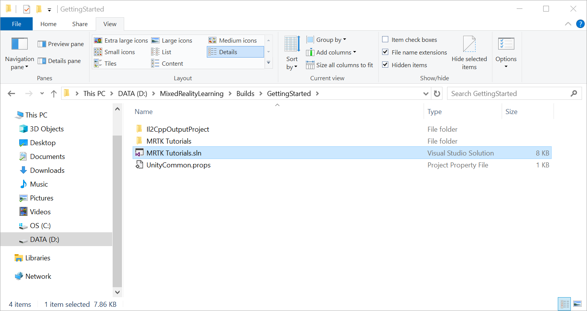
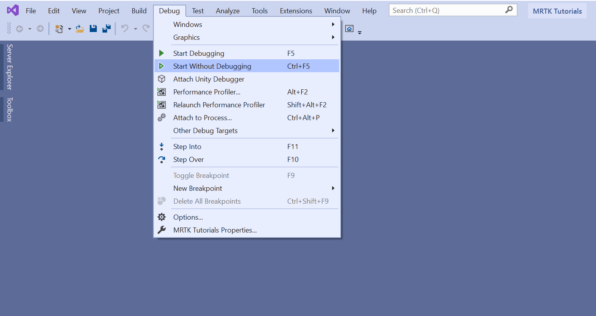

# Exercise: Initializing your project and configuring MRTK profiles

In this exercise, you'll learn how to create a new Unity project, configure it for Mixed Reality Toolkit (MRTK) development, and import MRTK. You'll also walk through configuring, building, and deploying a basic Unity scene from Visual Studio to your HoloLens 2. Once you have deployed it to your HoloLens 2, you should see a spatial mapping mesh covering the surfaces that are perceived by the HoloLens. Additionally, you should see indicators on your hands and fingers for hand tracking and a frame rate counter for keeping an eye on app performance.

## Creating the Unity project

1. Launch **Unity Hub**, select the **Projects** tab, and click the **down arrow** next to the **New** button:

2. In the dropdown, select the Unity **version** specified in the [Prerequisites](beginner-mrtk-tutorials-introduction.md#prerequisites):

> [!TIP]
> If the particular Unity version is not available in Unity Hub, you can initiate the installation from Unity's <a href="https://unity3d.com/get-unity/download/archive" target="_blank">Download Archive</a>.

3. In the Create a new project window:

* Ensure **Templates** is set to **3D**
* Enter a suitable **Project Name**, for example, _MRTK Tutorials_
* Choose a suitable **Location** to store your project, for example, _D:\MixedRealityLearning_
* Click the **Create** button to create and launch your new Unity project

> [!CAUTION]
> When working on Windows, there is a MAX_PATH limit of 255 characters. Consequently, you should save the Unity project close to the root of the drive.

Wait for Unity to create the project:

## Switching the build platform

[!INCLUDE]

## Importing the TextMeshPro Essential Resources

1. In the Unity menu, select **Window** > **TextMeshPro** > **Import TMP Essential Resources** to open the Import Unity Package window:

2. In the Import Unity Package window, click the **All** button to ensure all the assets are selected, then click the **Import** button to import the assets:

## Importing the Mixed Reality Toolkit and Configuring the Unity project

To Import Mixed Reality Toolkit into the Unity Project you will have to use Mixed Reality Feature Tool which allows developers to discover, update, and add Mixed Reality feature packages into Unity projects. You can search packages by name or category, see their dependencies, and even view proposed changes to your projects manifest file before importing.

1. Open the executable file **MixedRealityFeatureTool** from the downloaded folder to launch the Mixed Reality Feature Tool.

[!INCLUDE]

## Creating the scene and configuring MRTK

1. In the Unity menu, select **File** > **New Scene**:

2. In the **New Scene** window select **Basic (Built-in)** and click on **create** to create a new scene:

> [!NOTE]
> Above screenshot is from Unity Version 2020, if you are using Unity 2019 when you click on **create** a new empty scene will be created.

3. In the Unity menu, select **Mixed Reality** > **Toolkit** > **Add to Scene and Configure...** to add the MRTK to your current scene:

4. With the **MixedRealityToolkit** object still selected in the Hierarchy window, in the Inspector window, verify that the **MixedRealityToolkit** configuration profile is set to **DefaultMixedRealityToolkitConfigurationProfile**:

5. In the Unity menu, select **File** > **Save As...** to open the Save Scene window:

6. Save the scene in you project under **Asset** > **Scenes**.

## Importing the tutorial assets

Download the following Unity custom package:

* [MRTK.HoloLens2.Unity.Tutorials.Assets.GettingStarted.2.5.0.1.unitypackage](https://github.com/microsoft/MixedRealityLearning/releases/download/getting-started-v2.5.0/MRTK.HoloLens2.Unity.Tutorials.Assets.GettingStarted.2.5.0.1.unitypackage)

1. To Import a Unity custom package, In the Unity menu, select **Assets** > **Import Package** > **Custom Package...** to open the Import package... window:

2. In the Import package... window, select the **MRTK.HoloLens2.Unity.Tutorials.Assets.GettingStarted.2.5.0.1.unitypackage** you downloaded and click the Open button:

3. In the Import Unity Package window, click the All button to ensure all the assets are selected, then click the Import button to import the assets:

## Configuring the Scene

1. In the Project window, navigate to the **Assets** > **MRTK.Tutorials.GettingStarted** > **Prefabs** folder:

From the Project window, click-and-drag the **Cube** prefab on to the Hierarchy window, then in the Inspector window configure its **Transform** component as follows

* **Position**: X = 0, Y = 0, Z = 0.5
* **Rotation**: X = 0, Y = 0, Z = 0
* **Scale**: X = 1, Y = 1, Z = 1

2. To focus in on the objects in the scene, you can double-click on the **Cube** object, and then zoom slightly in again:

To interact and grab an object with tracked hands, the object must have Collider component for example a **Box Collider**,  **Object Manipulator (Script)** component and **NearInteractionGrabbable(Script)** component.

With the **Cube** still selected in the Hierarchy window, in the Inspector window ,click on **Add Component** button, then search and select **Object Manipulator** script to add the Object Manipulator script to the cube object.

3. Repeat the same to add **Near Interaction Grabbable script** to the cube

4. To test this in the Unity editor, you can enter the play mode and hold the **LeftShift** or **Space** key to enable the controller, Mouse movement will move the controller and also it can be moved further or closer to the camera using the mouse wheel. Once the pointer is on the Cube  press and hold **Left Mouse Button** to move the the Cube object.

## Building your application to your HoloLens 2

### Build the Unity project

1. In the Unity menu, select **File** > **Build Settings...** to open the Build Settings window.
In the Build Settings window, click the **Add Open Scenes** button to add your current scene to the **Scenes In Build** list, then click the **Build** button to open the Build Universal Windows Platform window:

2. In the Build Universal Windows Platform window, choose a suitable location to store your build, for example, _D:\MixedRealityLearning\Builds_, create a new folder and give it a suitable name, for example, _GettingStarted_, and then click the **Select Folder** button to start the build process:

### Build and deploy the application

1. When the build process has completed, Unity will prompt Windows File Explorer to open the location you stored the build. Navigate inside the folder, and double-click the solution file to open it in Visual Studio:

> [!NOTE]
> If Visual Studio asks you to install new components, take a moment to check that you have all the prerequisite components in the **[Install the Tools](../../install-the-tools.md)** documentation.

2. Configure Visual Studio for HoloLens by selecting the **Master** or **Release** configuration, the **ARM64** architecture, and **Device** as target:

> [!NOTE]
> If you're deploying to HoloLens (1st generation), select the **x86** architecture. If you're deploying to a WMR Headset, select the **x64** architecture and Local Machine as target. If you don't see Device as a target option, you may need to change the startup project for the Visual Studio solution from the IL2CPP project to the UWP project. To do this, in the Solution Explorer, right-click on YourProjectName (Universal Windows) and select **Set as StartUp Project**.

3. Connect your HoloLens to your computer, then select **Debug** > **Start Without Debugging** to build and deploy to your device:

4. Using Start Without Debugging automatically starts the app on your device without the Visual Studio debugger attached.
Select **Build > Deploy Solution** to deploy to your device without having the app start automatically.

## Changing the Spatial Awareness Display Option

The main steps you will take to hide the spatial awareness mesh are:

1. Clone the default Configuration Profile
2. Enable the Spatial Awareness System
3. Clone the default Spatial Awareness System Profile
4. Clone the default Spatial Awareness Mesh Observer Profile
5. Change the visibility of the spatial awareness mesh

### Clone the default Configuration Profile

1. In the Hierarchy window, select the **MixedRealityToolkit** object, then in the Inspector window, change the **MixedRealityToolkit** Configuration Profile to the **DefaultHoloLens2ConfigurationProfile**:

2. With the **MixedRealityToolkit** object still selected, in the Inspector window, click the **Clone** button to open the Clone Profile window:

3. In the Clone Profile window, enter a suitable **Profile Name**, for example, _GettingStarted_HoloLens2ConfigurationProfile_, then click the **Clone** button to create an editable copy of the **DefaultHololens2ConfigurationProfile**:

The newly created Configuration Profile is now assigned as the Configuration Profile for your scene.

4. In the Unity menu, select **File** > **Save** to save your scene.
