# 5. Exercise: Objects on the scene

In this exercise, you will position the provided objects from the tutorial assets in the scene. You will learn how to use the Grid Object Collection feature. you will explore ways to dynamically place holograms using the MRTK's available placement tools, known as Solvers, to solve complex spatial placement scenarios. You will use solvers to direct the user to objects and reposition objects.

## Creating the parent object

1. In the Hierarchy window, right-click on an empty spot, and select **Create Empty** to add an empty object to your scene:

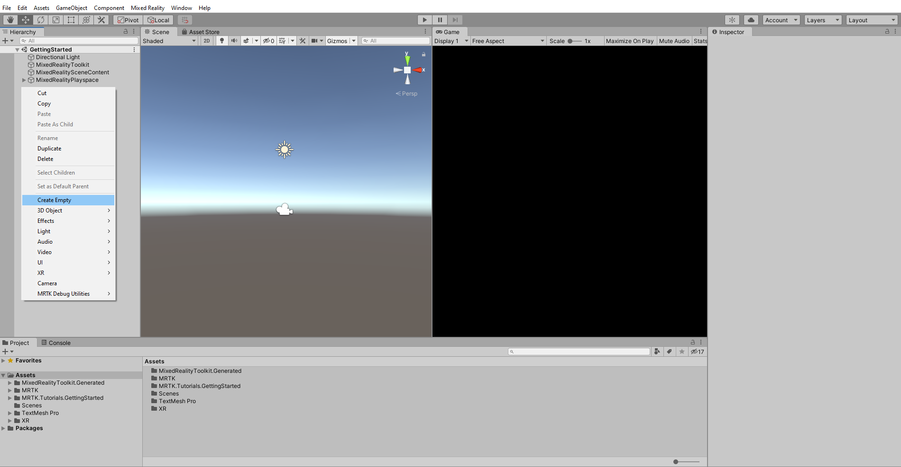

2. Right-click on the newly created object, select **Rename**, and change the name to **RoverExplorer**:

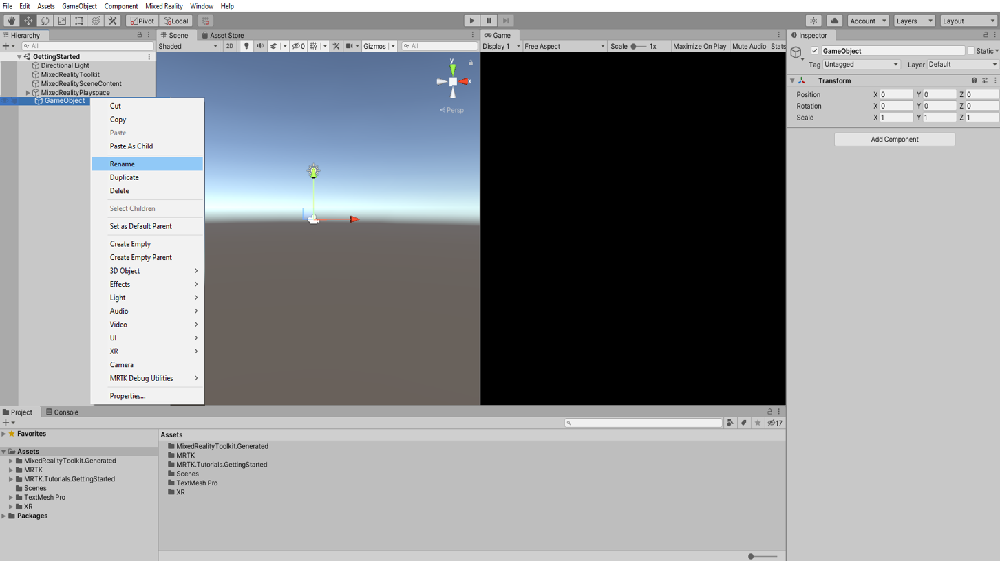

3. With the RoverExplorer object still selected, in the Inspector window, configure the **Transform** component as follows:

* **Position**: X = 0, Y = -0.6, Z = 2
* **Rotation**: X = 0, Y = 0, Z = 0
* **Scale**: X = 1, Y = 1, Z = 1

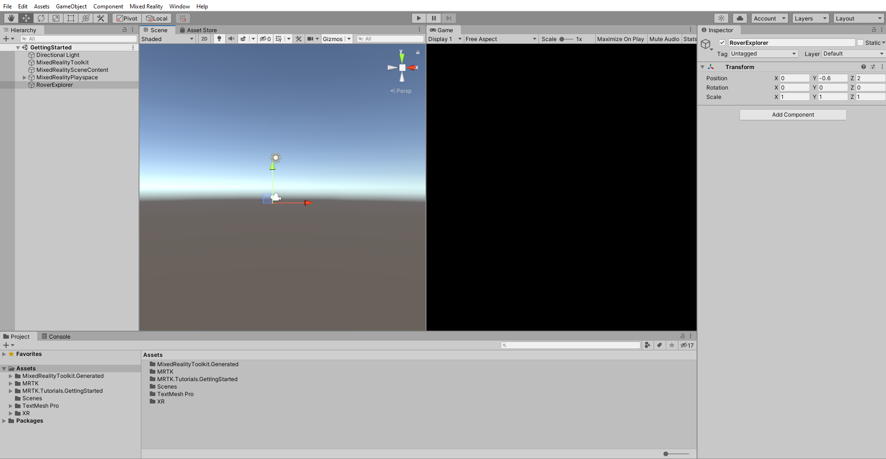

## Adding the tutorial prefabs

1. In the Project window, navigate to the **Assets** > **MRTK.Tutorials.GettingStarted** > **Prefabs** folder:

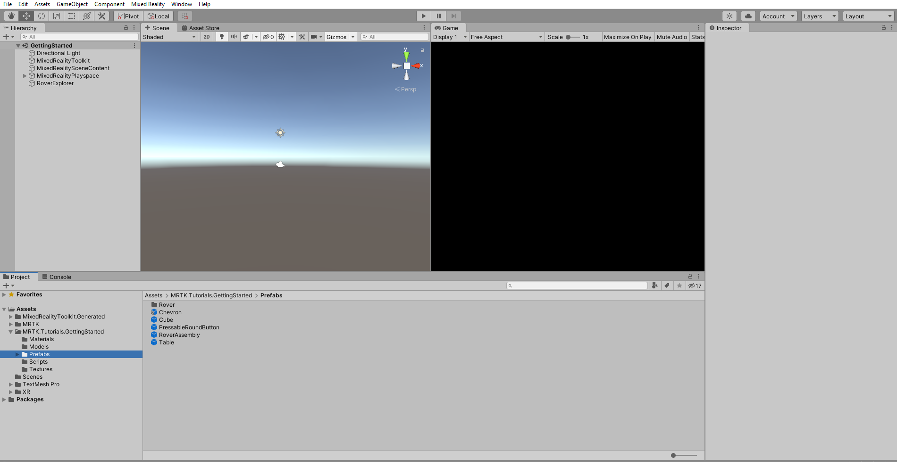

2. From the Project window, click-and-drag the **Table** prefab on to the **RoverExplorer** object to make it a child of the RoverExplorer object, then in the Inspector window, configure the **Transform** component as follows:

* **Position**: X = 0, Y = -0.005, Z = 0
* **Rotation**: X = 0, Y = 0, Z = 0
* **Scale**: X = 1.2, Y = 0.01, Z = 1.2

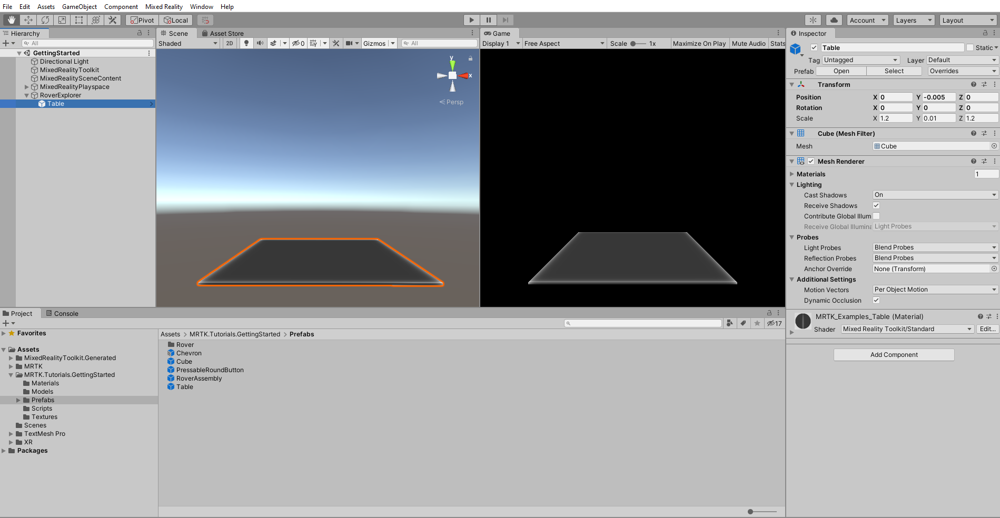

3. From the Project window, click-and-drag the **RoverAssembly** prefab on to the **RoverExplorer** object to make it a child of the RoverExplorer object, then in the Inspector window, configure the **Transform** component as follows:

* **Position**: X = -0.1, Y = 0, Z = 0
* **Rotation**: X = 0, Y = -135, Z = 0
* **Scale**: X = 1, Y = 1, Z = 1

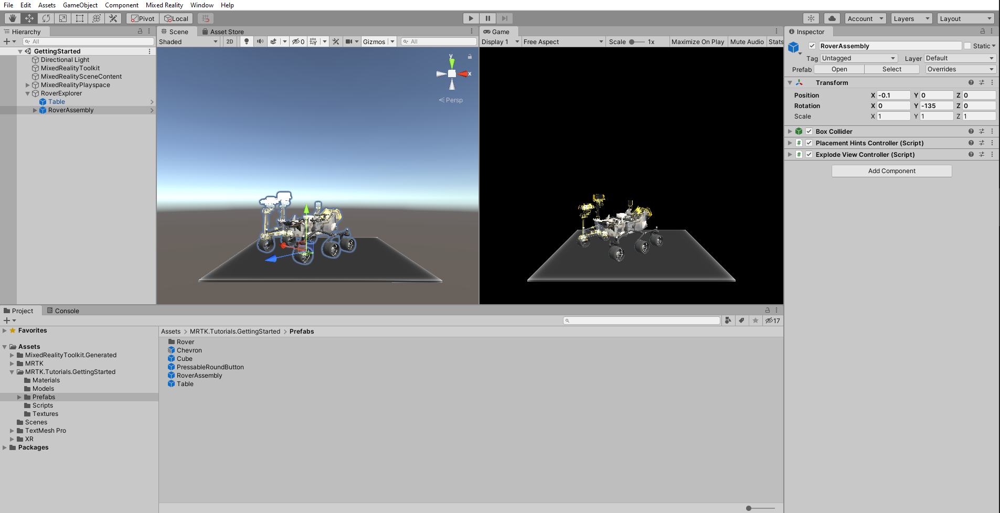

## Organizing objects in a collection

1. In the Hierarchy window, right-click on the **RoverExplorer** object and select **Create Empty** to add an empty object as a child of the RoverExplorer, name the object **RoverParts**, and configure the **Transform** component as follows:

* **Position**: X = 0, Y = 0.06, Z = 0
* **Rotation**: X = 0, Y = 90, Z = 0
* **Scale**: X = 1, Y = 1, Z = 1

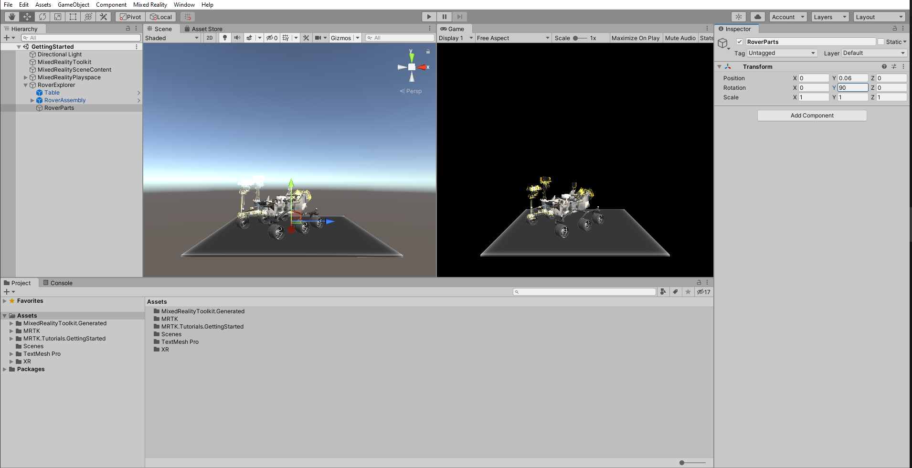

2. In the Hierarchy window, select all the RoverExplorer > RoverAssembly > RoverModel > **Parts** child objects, right-click on them and select **Duplicate** to create a copy of each of the parts:

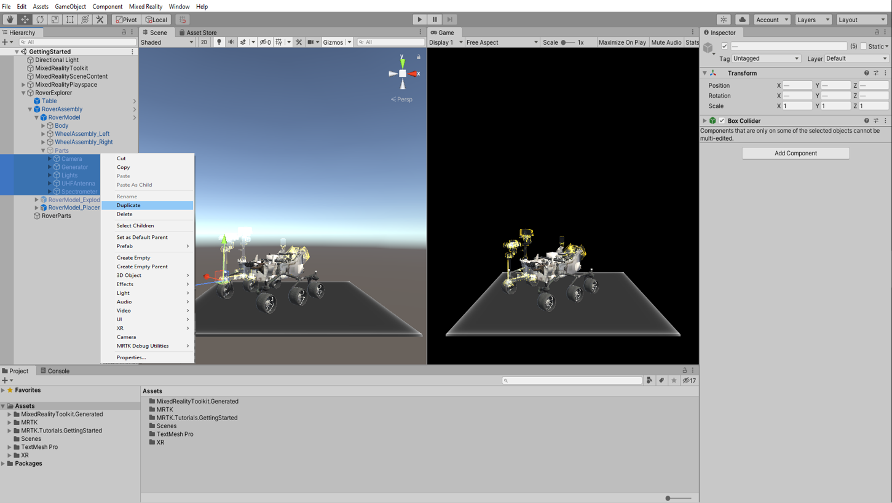

3. With the newly duplicated Parts child objects still selected, click-and-drag them on to the **RoverParts** object to make them child objects of the RoverParts object:

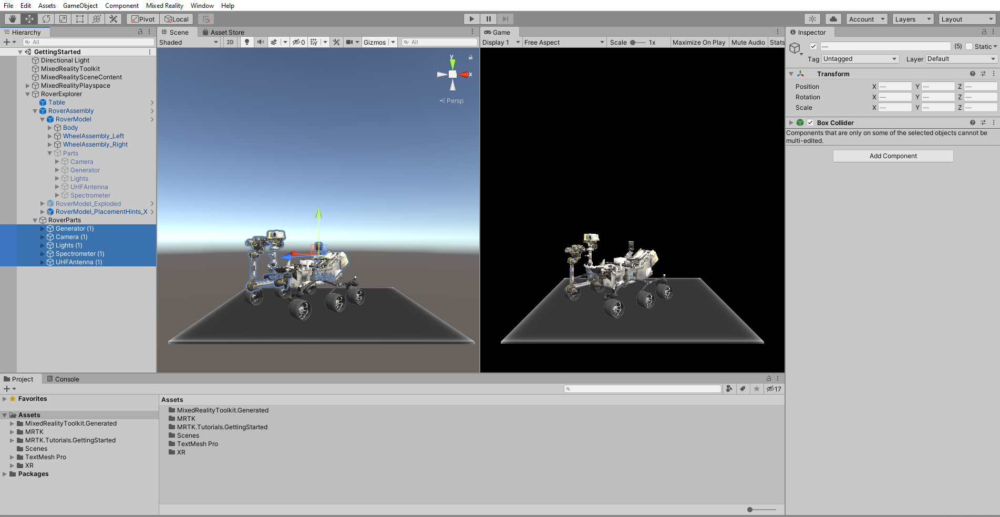

4. To make it easier to work with your scene, in the Hierarchy window, click the **eye** icon to the left of the object to toggle the **scene visibility** for the **RoverAssembly** object off. This hides the object in the Scene window without changing its in-game visibility:

5. In the Hierarchy window, clean up the RoverParts child objects' names by replacing the appended **(1)** with **_Part**:

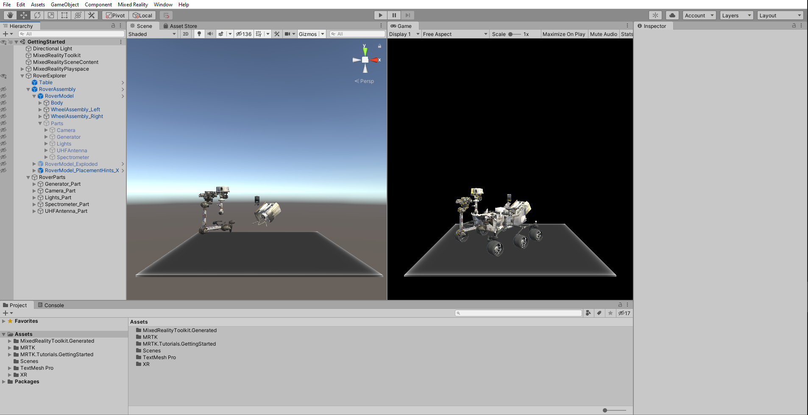

6. In the Hierarchy window, select the **RoverParts** object, then in the Inspector window, click the **Add Component** button, and search for and select **GridObjectCollection** to add the GridObjectCollection component to the RoverParts object:

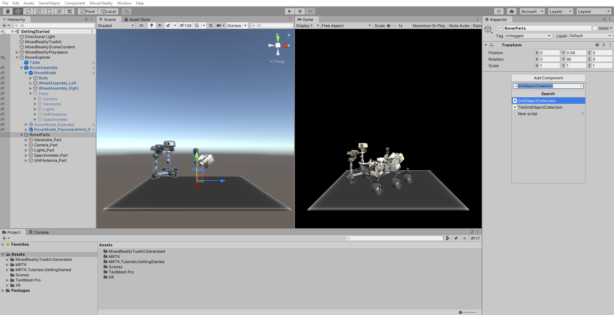

7. Configure the **GridObjectCollection** component values as follows:

* **Sort Type**: Alphabetic
* **Layout**: Horizontal
* **Cell Width**: 0.25
* **Distance from parent**: 0.38

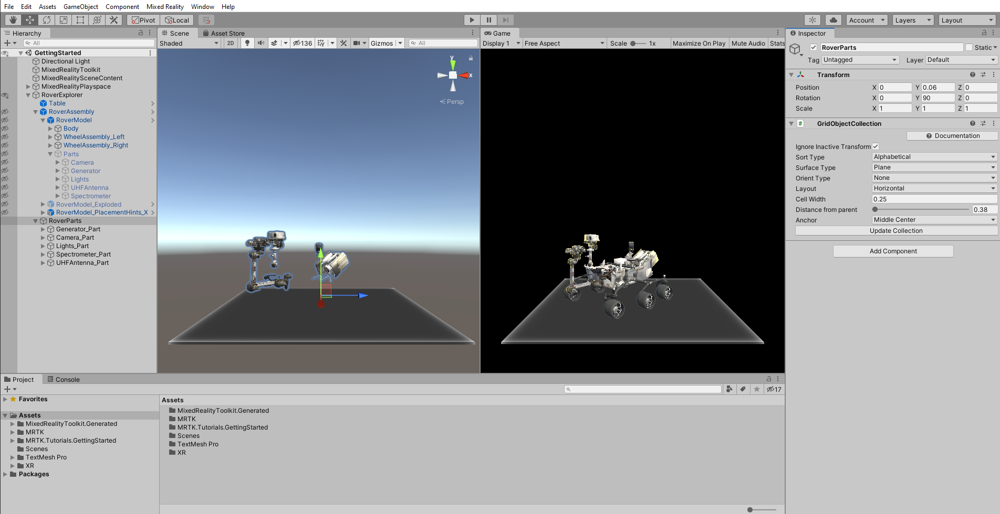

Then click the **Update Collection** button to update the position of the RoverParts child objects.

## Location of Solvers in the MRTK

1. The MRTK's Solvers are located in the MRTK SDK folder. To see the available Solvers in your project, in the Project window, navigate to **Packages** > **Mixed Reality Toolkit Foundation** > **SDK** > **Features** > **Utilities** > **Solvers**:

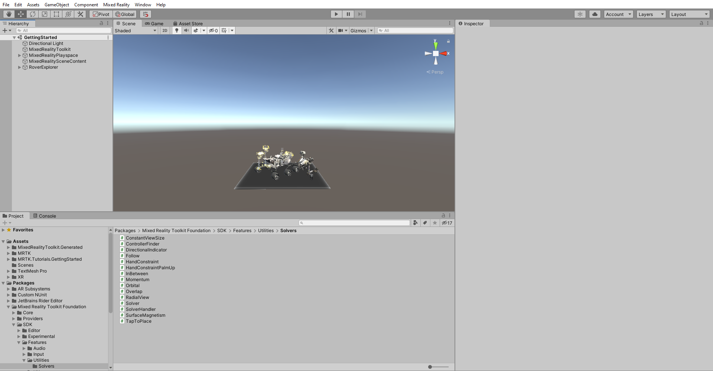

## Using the Directional Indicator Solver to direct the user to objects

1. In the Project window, navigate to the **Assets** > **MRTK.Tutorials.GettingStarted** > **Prefabs** folder, click-and-drag the **Chevron** prefab into the Hierarchy window, and set it's Transform **Position** to X = 0, Y = 0, Z = 2 to position it near the RoverExplorer object:

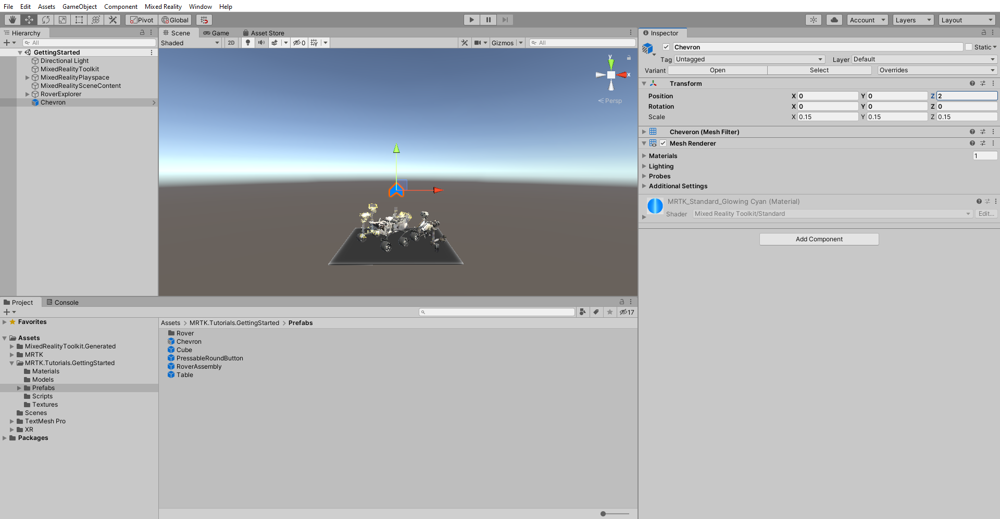

2. Rename the newly added Chevron object to **Indicator**, then in the Inspector window, use the **Add Component** button to add the **DirectionalIndicator**:

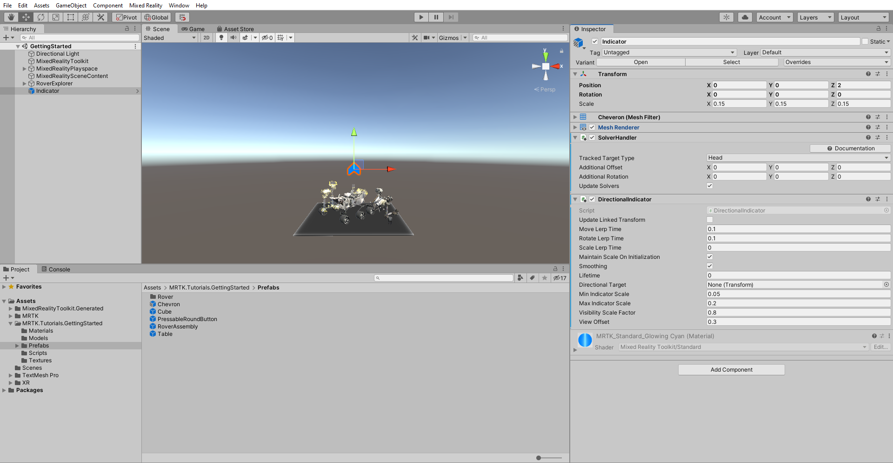

3. Configure the DirectionalIndicator and SolverHandler components as follows:

* Verify that the **SolverHandler** component's **Tracked Target Type** is set to **Head**
* Assign the **RoverExplorer** to the **DirectionalIndicator** component's **Directional Target** by dragging it from the Hierarchy window into the **None (Transform)** field
* Change the **View Offset** to 0.2

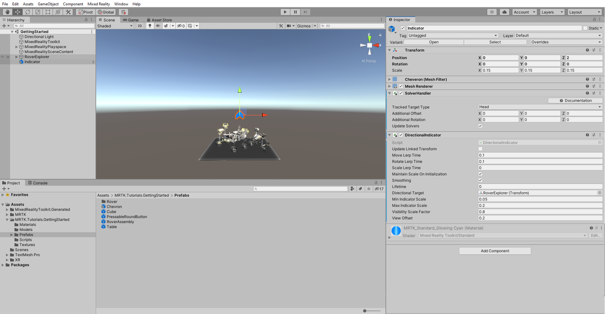

4. Press the Play button to enter Game mode, press-and-hold the right mouse button while moving your mouse to the left or right to rotate your gaze direction, and notice the following:

* When you look away from the RoverExplorer object, the Indicator object will appear and point towards the RoverExplorer object

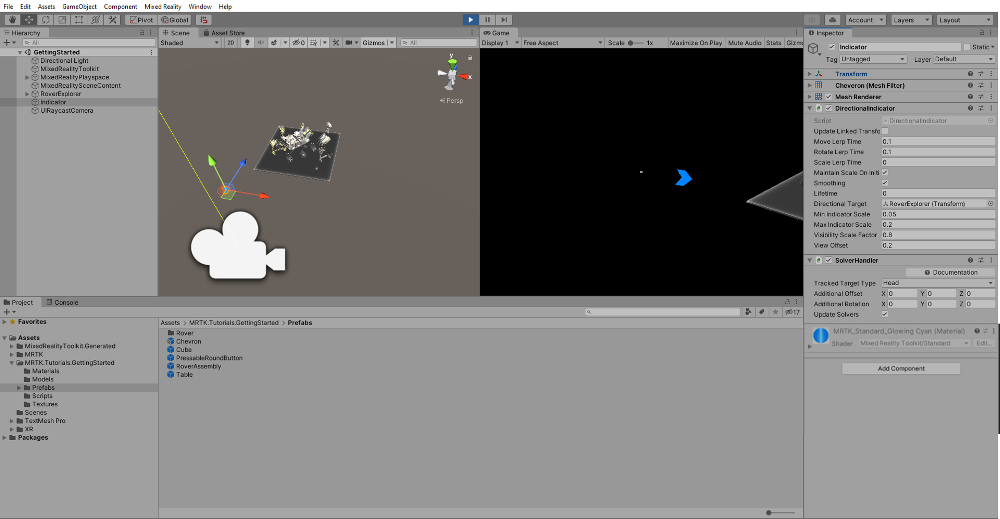

## Using the Tap to Place Solver to reposition objects

1. In the Hierarchy window, select the RoverExplorer > **RoverAssembly** object, then in the Inspector window, use the **Add Component** button to add the **Tap To Place (Script)** component, and configure it as follows:

* Verify that the **SolverHandler** component's **Tracked Target Type** is set to **Head**
* Uncheck the **Use Default Surface Normal Offset** and ensure **Surface Normal Offset** is set to 0
* Check the **Keep Orientation Vertical** checkbox
* From the **Magnetic Surfaces** > **Element 0** dropdown, uncheck all options expect **Spatial Awareness**

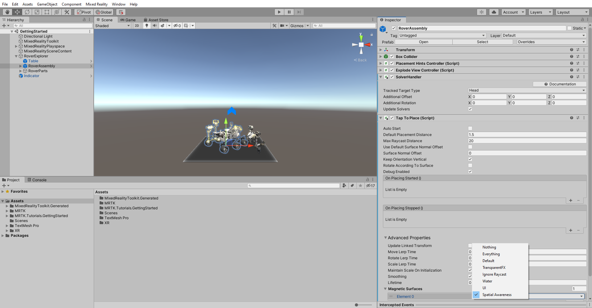

2. With the RoverAssembly object still selected in the Hierarchy window, in the Inspector window, locate the **On Placing Started ()** event and click the **+** icon to add a new event:

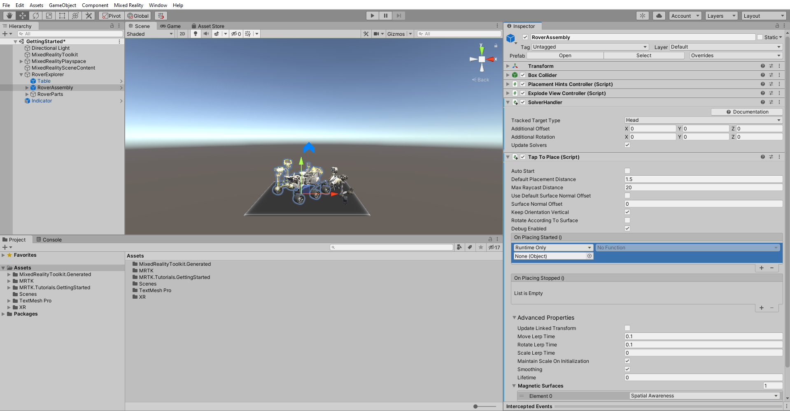

3. Configure the event as follows:

* Assign the **RoverAssembly** object as a listener for the On Placing Started () event by dragging it from the Hierarchy window into the **None (Object)** field
* From the **No Function** dropdown, select **TapToPlace** > **float SurfaceNormalOffset** to update the SurfaceNormalOffset property value when the event is triggered
* Verify that the argument is set to **0**

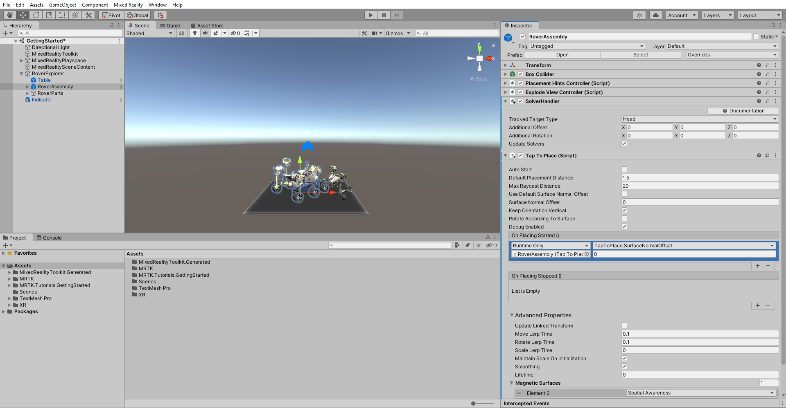

4. In the Hierarchy window, right-click on an empty spot and select **3D Object** > **Cube**, to create a temporary object representing the ground, and configure the **Transform** component as follows:

* **Position**: X = 0, Y = -1.65, Z = 6
* **Rotation**: X = 0, Y = 0, Z = 0
* **Scale**: X = 10, Y = 0.2, Z = 10

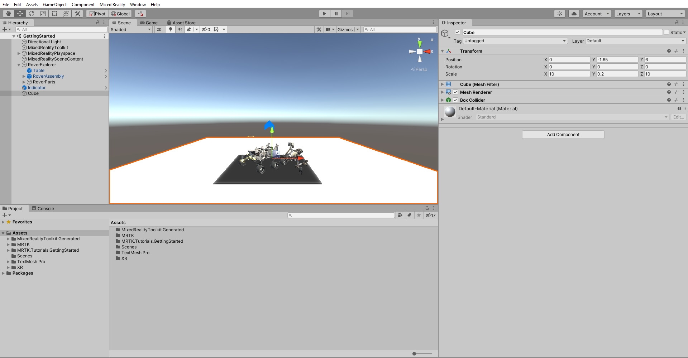

5. With the temporary Cube still selected in the Hierarchy window, in the Inspector window, use the **Layers** dropdown to change the Cube's Layer setting only to include the **Spatial Awareness** layer:

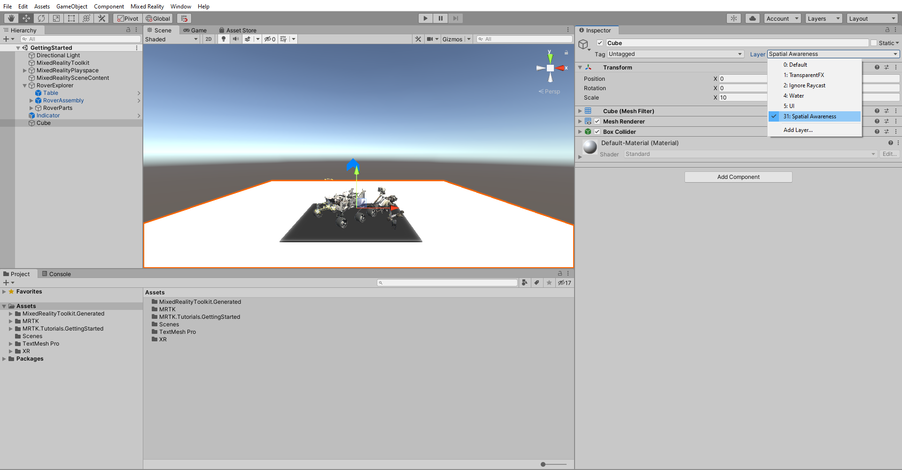

6. Press the Play button to enter Game mode, then press-and-hold the right mouse button while moving your mouse down until the gaze hit's the RoverAssembly object:

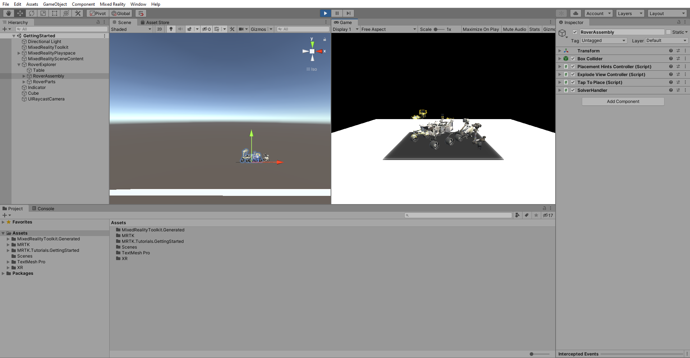

7. Click the left mouse button to start the tap-to-place process:

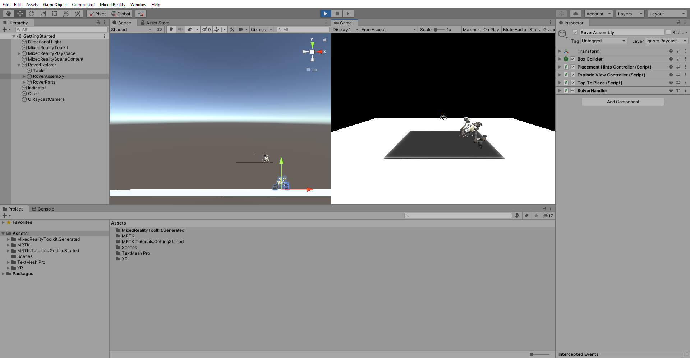

8. Press-and-hold the right mouse button while moving your mouse to the left or right to rotate your gaze direction, when you are happy with the placement, click the left mouse button:

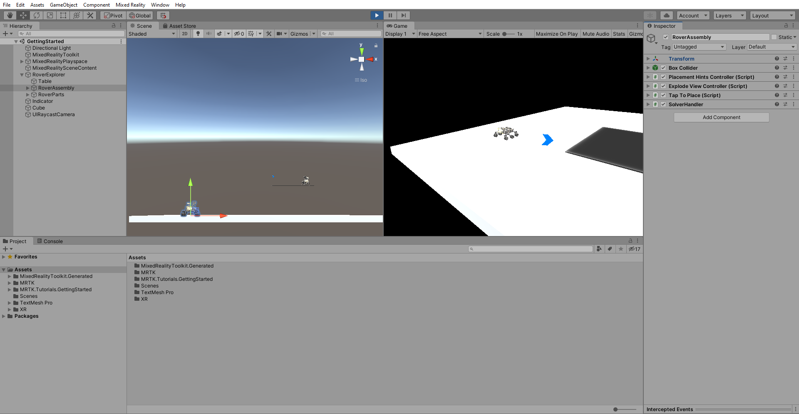

9. Once you are done testing the feature in the Game mode, right-click on the Cube object and select **Delete** to remove it from the scene:

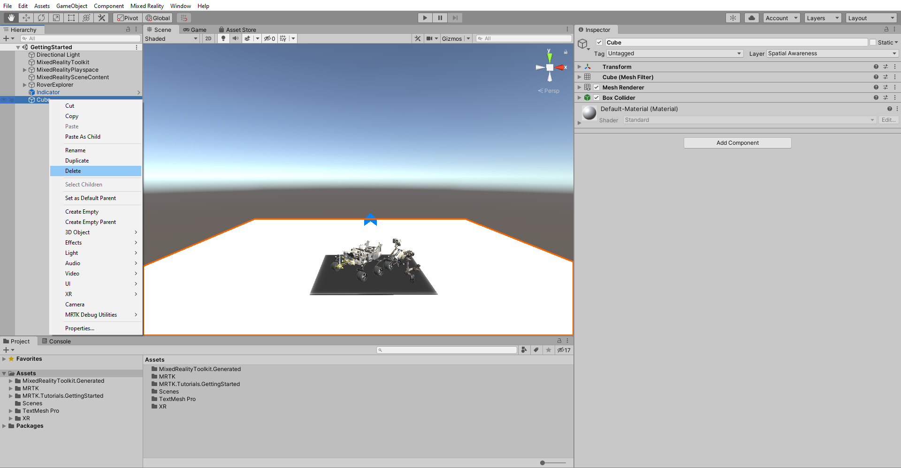

[Next](user-interface-and-interaction-models.md)
