# Exercise: Input

In this exercise, you will learn how to enable eye-tracking for HoloLens 2 and add eye-tracking to objects to trigger actions when the user looks at the objects. You will also learn how to create speech commands and how to control them globally. You will also learn how to control local speech commands that require the user to look at the object that controls the speech command.

## Ensuring the Eye Gaze Input capability is enabled

1. In the Unity menu, select Mixed Reality > Toolkit > Utilities > **Configure Project for MRTK** to open the **MRTK Project Configurator** window, then in the **UWP Capabilities** section, verify that **Enable Eye Gaze Input Capability** is greyed out:

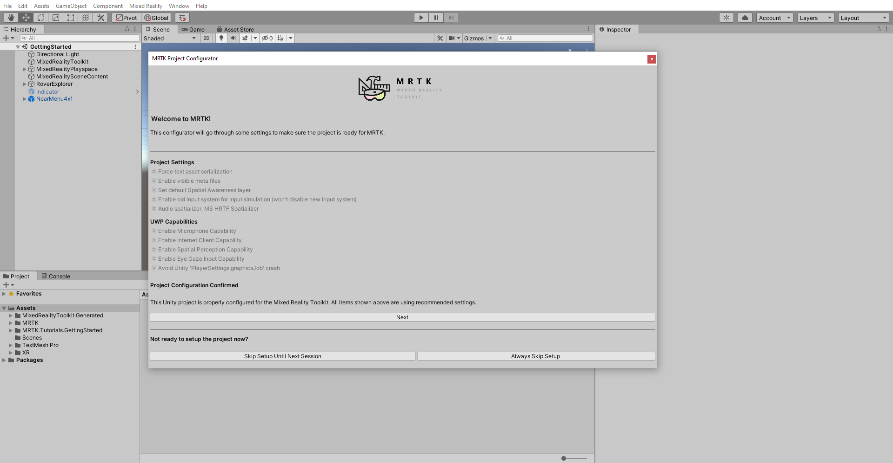

## Enabling eye based gaze in the gaze provider

1. In the Hierarchy window, select the **MixedRealityToolkit** object, then in the Inspector window, select the MixedRealityToolkit > **Input** tab and take the following steps:

    * Clone the **DefaultHoloLens2InputSystemProfile** and give it a suitable name, for example, GettingStarted_HoloLens2InputSystemProfile.
    * Expand the **Pointers** section
    * Clone the **DefaultMixedRealityPointerProfile** and give it a suitable name, for example, GettingStarted_MixedRealityPointerProfile
    * Locate the **Gaze Settings** section and check the **Is Eye Tracking Enabled** checkbox

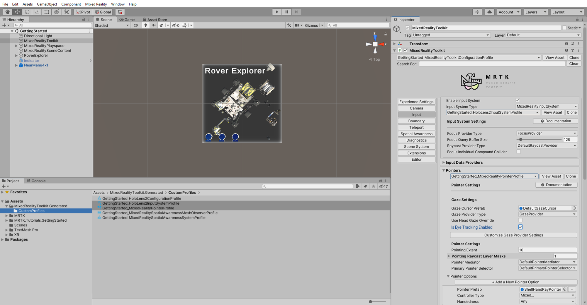

## Enabling simulated eye-tracking for the Unity editor

1. In the Hierarchy window, select the MixedRealityToolkit object, then in the Inspector window, navigate to the Input tab, then:

    * Expand the **Input Data Providers** > **Input Simulation Service** section
    * Clone the **DefaultMixedRealityInputSimulationProfile** and give it a suitable name, for example, GettingStarted_MixedRealityInputSimulationProfile
    * Locate **Eye Gaze Simulation** and set the **Default Eye Gaze Simulation Mode** to **Camera Forward Axis**

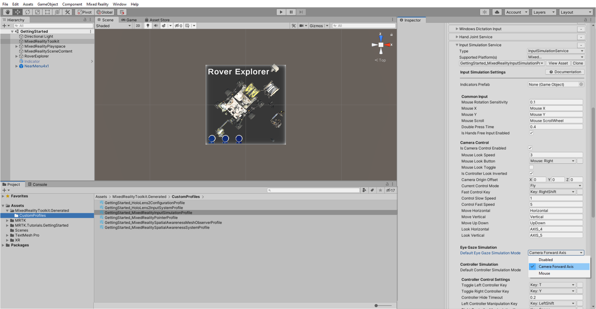

## Adding eye-tracking to objects

1. In the Hierarchy window, expand the **RoverExplorer** > **Buttons**, then select all three of the child button objects:

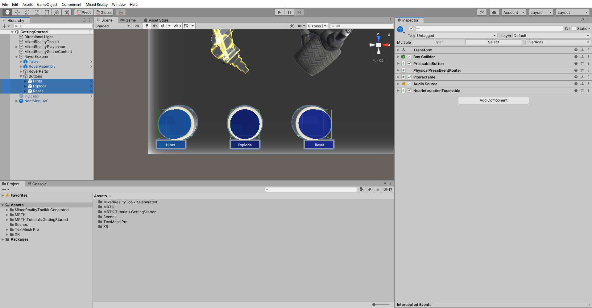

2. With all three Button objects still selected, in the Inspector window use the **Add Component** button to add the **EyeTrackingTarget** component to all the selected objects:

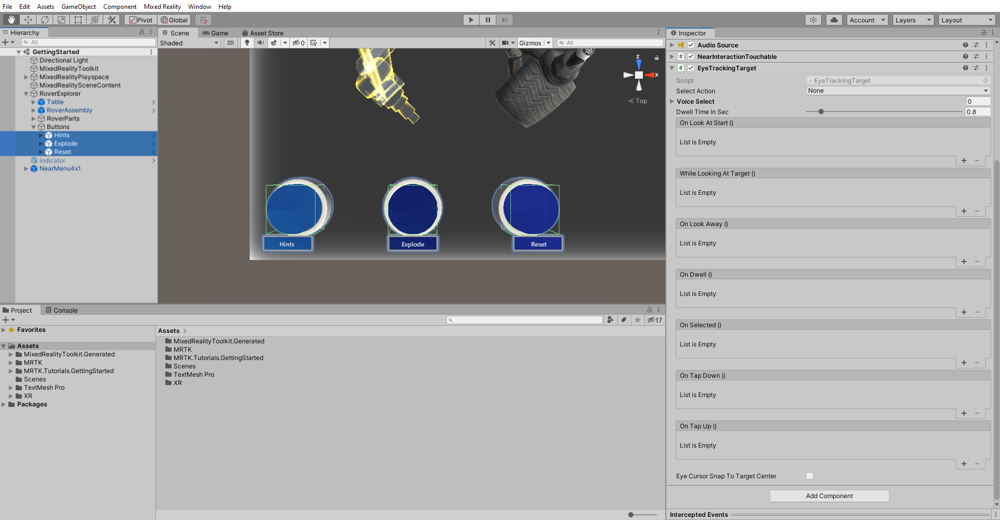

3. In the Hierarchy window, expand **RoverExplorer** > **Buttons** > **Hints** > **SeeItSayItLabel** > **TextMeshPro**. Then in the Hierarchy window, select the Hints button object , and configure the **EyeTrackingTarget** component as follows:

    * In the **On Look At Start ()** event section
        * Click the small + icon to add another event
        * Assign the **TextMeshPro** object from the **Hints** button to the **None (Object)** field
        * From the **No Function** dropdown, select **TextMeshPro** > **float fontSize** to update this property value when the event is triggered
        * Set the argument to **0.06** to increase the current font size of 0.04 by 50%

    * In the **On Look Away ()** event section
        * Click the small + icon to add another event
        * Assign the **TextMeshPro** object from the **Hints** button to the **None (Object)** field
        * From the **No Function** dropdown, select **TextMeshPro** > **float fontSize** to update this property value when the event is triggered
        * Set the argument to **0.04** to reset the font size back to 0.04

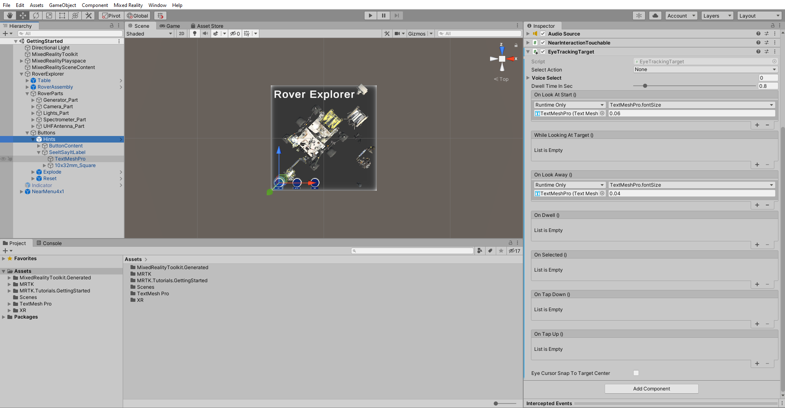

4. Repeat this step for the **Explode** and **Reset** button object to configure eye tracking for remaining buttons. If you now enter Game mode and then press-and-hold the right mouse button while moving your mouse until the gaze hit's one of the buttons, you will see the text font size increase by 50% and reset back to its original size when looking away:

## Ensuring the Microphone capability is enabled

1. In the Unity menu, select Mixed Reality > Toolkit > Utilities > **Configure Project for MRTK** to open the **MRTK Project Configurator window**, then in the **UWP Capabilities** section, verify that **Enable Microphone Capability** is greyed out:

## Creating speech commands

1. In the Hierarchy window, select the **MixedRealityToolkit** object, then in the Inspector window, select the MixedRealityToolkit > **Input** tab and take the following steps:
    * Expand the **Speech** section
    * Clone the **DefaultMixedRealitySpeechCommandsProfile** and give it a suitable name, for example, GettingStarted_MixedRealitySpeechCommandsProfile
    * Verify that **Start Behaviour** is set to **Auto Start**

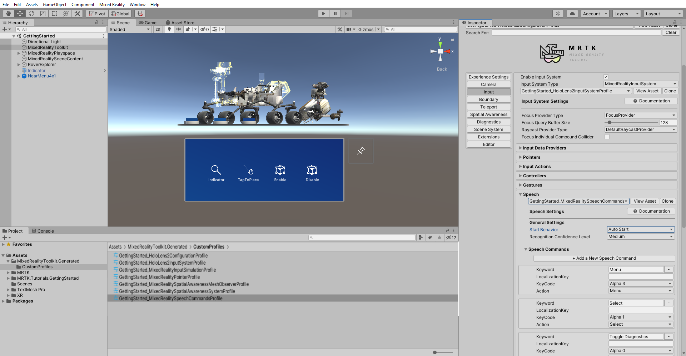

2. In the Speech > **Speech Commands** section, click the **+ Add a New Speech Command** button four times to add four new speech commands to the list of the existing speech commands, then in the **Keyword** fields enter the following phrases:
    ● Enable Indicator
    ● Enable Tap to Place
    ● Enable Bounds Control
    ● Disable Bounds Control

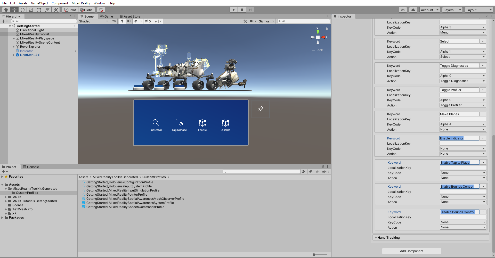

## Controlling speech commands

1. In the Project window, navigate to the **Package** > **Mixed Reality Toolkit Foundation** > **SDK** > **Features** > **UX** > **Prefabs** > **ToolTip** folder to locate the tooltip prefabs:

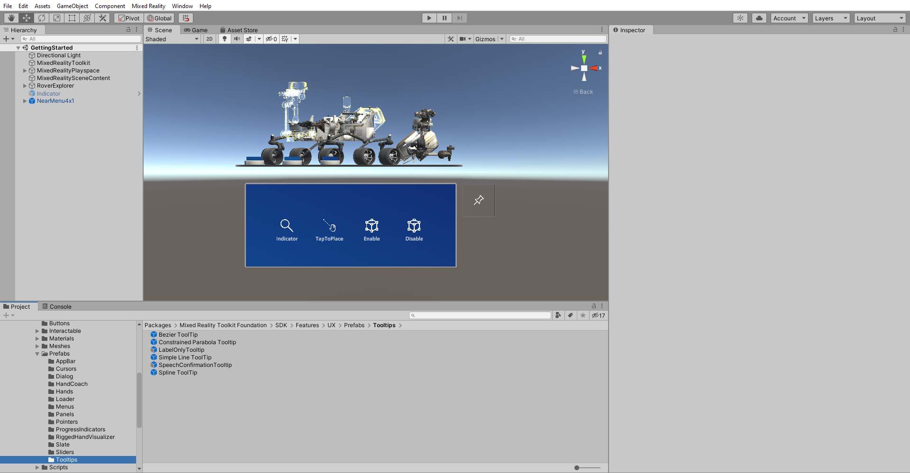

2. In the Hierarchy window, right-click on an **empty spot** and select Create Empty to add an empty object to your scene. Name the object **SpeechInputHandler_Global**, then in the Inspector window, use the **Add Component** button to add the **SpeechInputHandler** component and configure it as follows:
    * **Uncheck** the **Is Focus Required** checkbox, so the user is not required to look at the object with the SpeechInputHandler component to trigger the speech command
    * From the Project window, assign the **SpeechConfirmation Tooltip** prefab to the **Speech Confirmation Tooltip** Prefab field, to have this prefab appear when a speech command is recognized

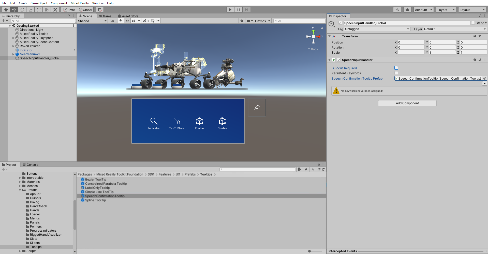

3. On the SpeechInputHandler component, click the small + icon three times to add three keyword elements:

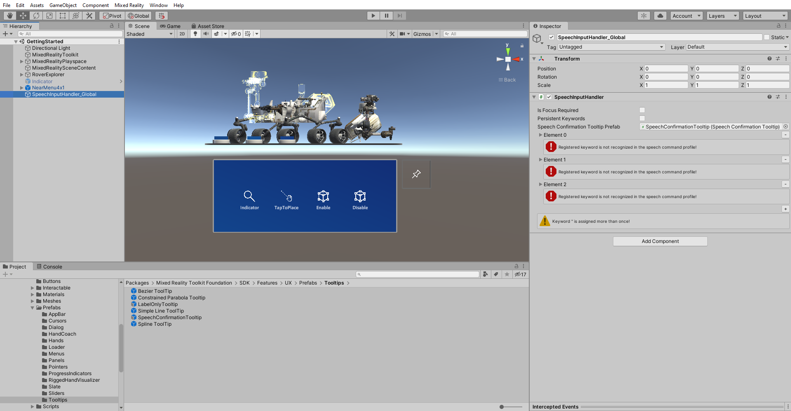

4. Expand **Element 0** and configure it as follows:
    * In the **Keyword** field, enter **Enable Indicator**, to reference the Enable Indicator speech command you created in the previous section
    * Click the small + icon to add an event
    * From the Hierarchy window, assign the **Indicator** object to the **None (Object)** field
    * From the **No Function** dropdown, select **GameObject** > **SetActive (bool)** to set this function as the action to be executed when the event is triggered
    * Check the argument checkbox, so it is **checked**

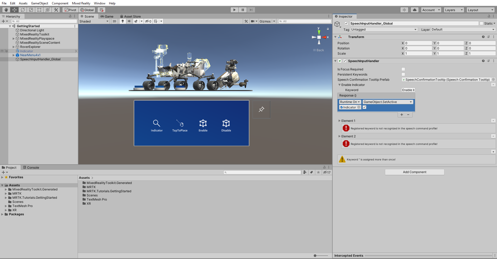

5. Expand **Element 1** and configure it as follows:                                                                     In the **Keyword** field, enter **Enable Bounds Control**, to reference the Enable Bounds Control command you created in the previous section
    * Click the small + icon to add an event
    * From the Hierarchy window, assign the **RoverExplorer** object to the **None (Object)** field
    * From the **No Function** dropdown, select **BoundsControl** > **bool enabled** to update this property value when the event is triggered
    * Check the argument checkbox, so it is **checked**
    * Click the small + icon to add another event
    * From the Hierarchy window, assign the **RoverExplorer** object to the **None (Object)** field
    * From the **No Function** dropdown, select **ObjectManipulator** > **bool enabled** to update this property value when the event is triggered
    * Check the argument checkbox, so it is **checked**.

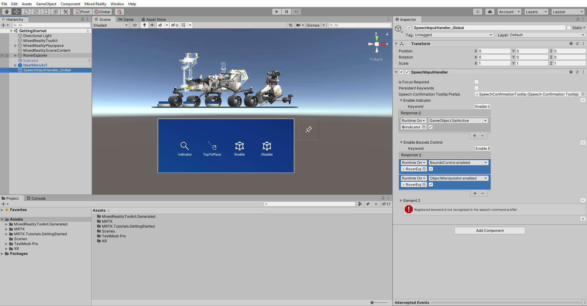

6. Expand **Element 2** and configure it as follows:
    * In the **Keyword** field, enter **Disable Bounds Control**, to reference the Disable Bounds Control command you created in the previous section
    * Click the small + icon to add an event
    * From the Hierarchy window, assign the **RoverExplorer** object to the **one (Object)** field
    * From the **No Function** dropdown, select **BoundsControl** > **bool enabled** to update this property value when the event is triggered
    * Verify that the argument checkbox is **unchecked**
    * Click the small + icon to add another event
    * From the Hierarchy window, assign the **RoverExplorer** object to the **None (Object)** field
    * From the **No Function** dropdown, select **ObjectManipulator** > **bool enabled** to update this property value when the event is triggered
    * Verify that the argument checkbox is **unchecked**.

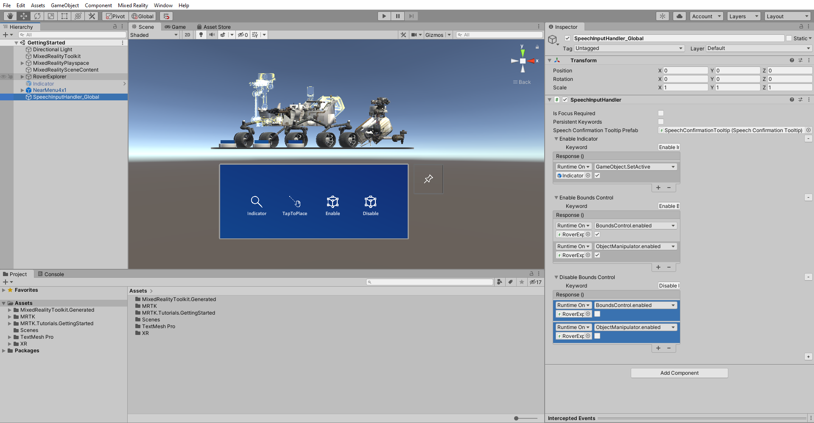

7. In the Hierarchy window, select the **RoverExplorer** > **RoverAssembly** object, then in the Inspector window, use the **Add Component** button to add the **SpeechInputHandler** component and configure it as follows:
    * Verify that the **Is Focus Required** checkbox is **check**, so the user is required to look at the object with the SpeechInputHandler component, i.e., the RoverAssembly, to trigger the speech command
    * From the Project window, assign the **SpeechConfirmation Tooltip** prefab to the Speech **Confirmation Tooltip Prefab** field, to have this prefab appear when a speech command is recognized.

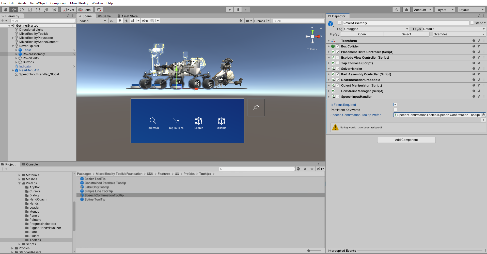

8. On the SpeechInputHandler component, click the small + icon to add a keyword element, expand the newly created element, then configure it as follows:
    * In the **Keyword** field, enter **Enable Tap to Place**, to reference the Enable Tap to Place command you created in the previous section
    * Click the small + icon to add an event
    * From the Hierarchy window, assign the object itself, i.e., the same **RoverAssembly** object, to the **None (Object)** field
    * From the **No Function** dropdown, select **TapToPlace** > **bool enabled** to update this property value when the event is triggered
    * Check the argument checkbox, so it is **checked**

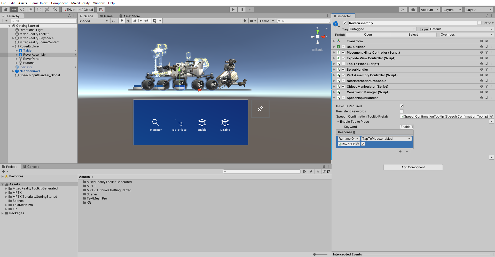