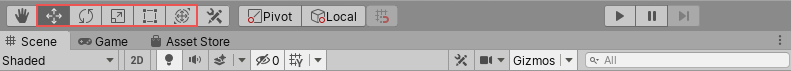

# 4. Objects on the scene

Positioning the game objects on the scene is a crucial step, as it helps you decide where your holograms must be placed in the surrounding. There are multiple ways in unity to place game objects on the scene. In this module, you’ll learn to position and arrange the game objects from the tutorial assets in the scene. You will also learn how to dynamically place holograms using MRTK’S available placement tools, known as Solvers, to solve complex spatial placement scenarios. You will use solvers to direct the user to objects and reposition objects.

## Positioning game objects

There are numerous situations when you want to position your game objects in an appropriate place or order. Unity assists you in moving, rotating, and scaling the game object.

You can use the highlighted options to move, rotate, scale, RectTransform, and Transform, respectively. RectTransform is used for changing the position of 2D objects such as sprites. Transform combines move, rotate, and scale tools.

## Parent Object

In Unity, objects use a hierarchy system where objects can become “parents” of other objects. When a game object has a parent game object, it performs all the transform changes concerning the Parent game object instead of the game world.

## Prefab

Prefabs are distinct components that allow completely configured game objects to be retained in a project for future use. These prefabs can be shared between scenes or even other projects without configuring them again. It is good practice to form prefabs while working in unity to avoid rework in the future.

## Scene Visibility

Scene Visibility control allows you to hide and show game objects in the scene without changing the in-game visibility. Scene Visibility is helpful while working on complex scenes with a lot of game objects. Using visibility is a preferred option over deactivating the game objects because visibility only affects the scene view, implying that you cannot accidentally remove game objects from a fully rendered scene.

## Organizing objects in a collection

Arranging objects in a collection is another functional feature provided by MRTK. You can use Grid Object Collection on a set of child objects to organize them with some layout parameters. The collection can be used to swiftly create control panels or a set of prefabs/objects.

## Solvers

It would be convenient to have some necessary menus to follow you around instead of it being stuck to a place. You would have to search for the menu every time you wanted to select some option. MRTK provides a handy feature called Solvers that calculates an object's position and orientation using predefined algorithms.
Solvers provide a wide range of behavior to attach objects to other objects or systems. One example would be the tag-along object which appears in front of the user (based on the camera) every time he moves.

1. DirectionalIndicator: Type of solver which facilitates tag-along components that orient themselves to the desired direction of the object in space.
2. TapToPlace: TapToPlace is a far component that helps in placing an object over a surface. This component is valuable when you want to place objects on the spatial mesh.

[Next](exercise-objects-on-the-scene.md)
