# Exercise: User Interface and interaction models

There are several ways of providing inputs and manipulating objects on the scene. Inputs are given to trigger certain events and perform some changes. Adding Bounds Control around 3D objects makes it easier to control the object manipulation.

## Creating a static panel of buttons

1. In the Hierarchy window, right-click on the RoverExplorer object and select Create Empty to add an empty object as a child of the RoverExplorer, name the object Buttons, and configure the Transform component as follows:
    * Position: X = -0.6, Y = 0.036, Z = -0.5
    * Rotation: X = 90, Y = 0, Z = 0
    * Scale: X = 1, Y = 1, Z = 1

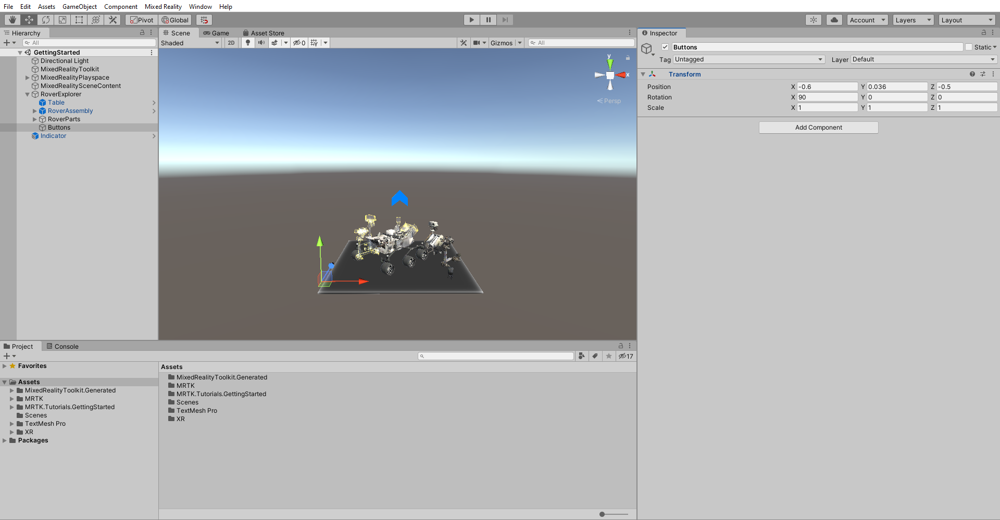

2. In the Project window, navigate to the Assets > MRTK.Tutorials.GettingStarted > Prefabs folder, click-and-drag the PressableRoundButton prefab on to the Buttons object, then right-click on the PressableRoundButton and select Duplicate to create a copy, repeat until you have a total of three PressableRoundButton objects:

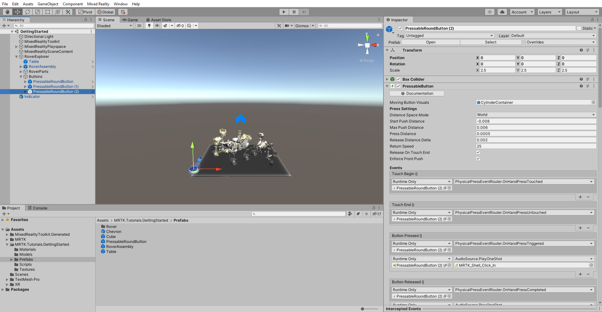

3. In the Hierarchy window, select the Buttons object, then in the Inspector window, use the Add Component button to add the GridObjectCollection component and configure it as follows:
    * Sort Type: Child Order
    * Layout: Horizontal
    * Cell Width: 0.2
    * Anchor: Middle Left

Then click the Update Collection button to update the position of the Buttons object's child objects:

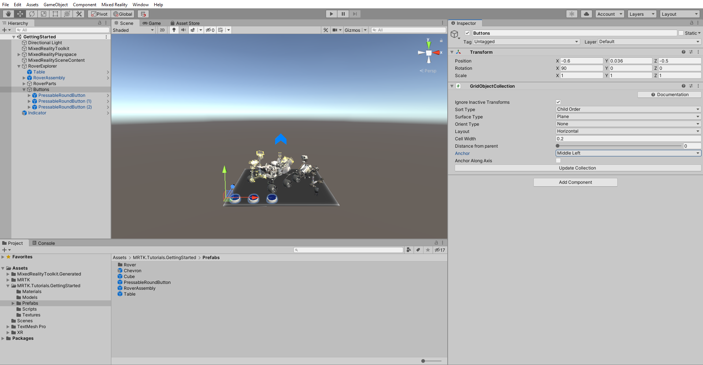

4. In the Hierarchy window, name the buttons Hints, Explode, and Reset.For each button, select the SeeItSayItLabel > TextMeshPro child object, then in the Inspector window, change the respective TextMeshPro - Text component text to match the button names:

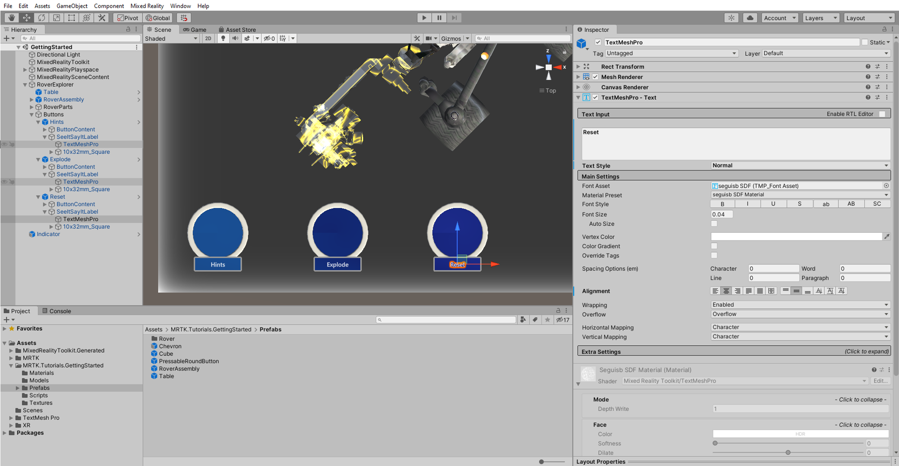

5. Once done, collapse the Buttons object's child objects.In the Hierarchy window, select the Hints button object, then in the Inspector window, configure the Interactable.OnClick () event as follows:
    * Assign the RoverAssembly object to the None (Object) field
    * From the No Function dropdown, select PlacementHintsController > TogglePlacementHints () to set this function as the action to be executed when the event is triggered

6. In the Hierarchy window, select the Explode button object, then in the Inspector window, configure the Interactable.OnClick () event as follows:
    * Assign the RoverAssembly object to the None (Object) field
    * From the No Function dropdown, select ExplodedViewController > ToggleExplodedView () to set this function as the action to be executed when the event is triggered

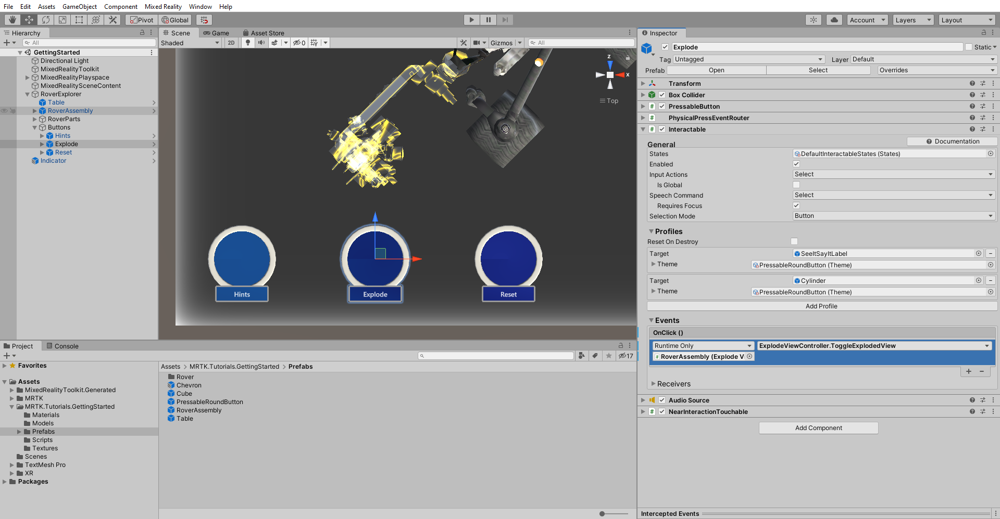

7. Press the Play button to enter Game mode, then press-and-hold the space bar button to activate the hand and use the mouse to press the Hints button to toggle the visibility of the placement hint objects:

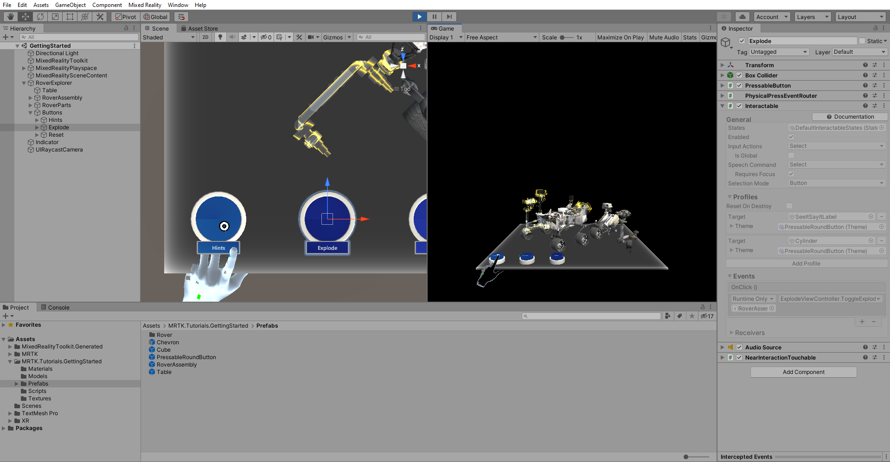

8. Explode button will toggle the exploded view on and off:

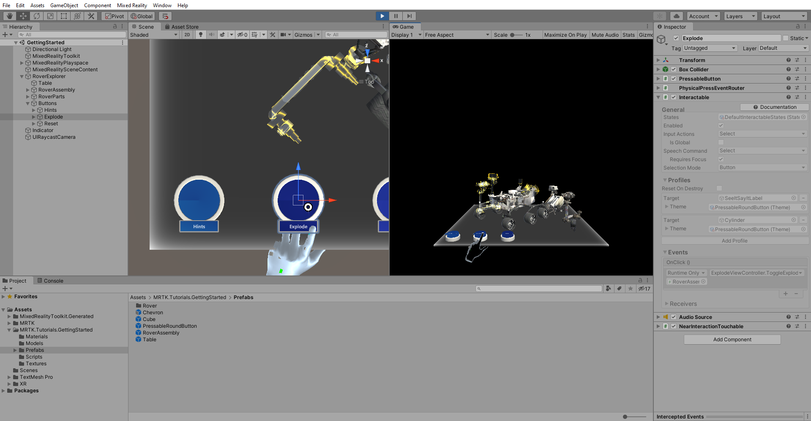

## Creating a dynamic menu that follows the user

1. In the Project window, navigate to the Packages > Mixed Reality Toolkit Foundation > SDK > Features > UX > Prefabs > Menus folder, click-and-drag the NearMenu4x1 prefab into the Hierarchy window, set its Transform Position to X = 0, Y = -0.4, Z = 0 and configure it as follows:
    * Verify that the SolverHandler component's Tracked Target Type is set to Head
    * Check the checkbox next to the RadialView Solver component so it is enabled by default

2. In the Hierarchy window, rename the object to Menu, then expand its ButtonCollection child object to reveal the four buttons:

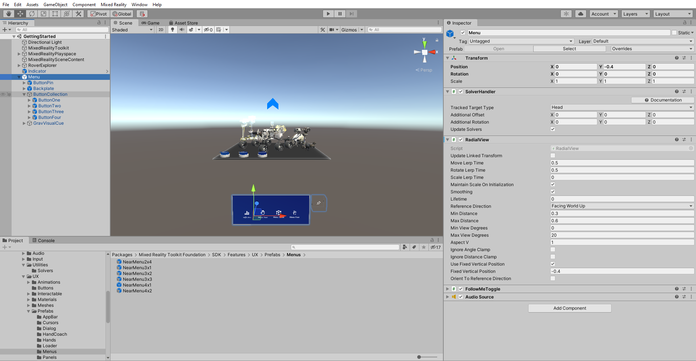

3. Rename the first button in the ButtonCollection to Indicator, then in the Inspector window, configure the Button Config Helper (Script) component as follows:

    * Change the **Main Label Text** to match the name of the button
    * Assign the Indicator object that looks like a chevron, to the None (Object) field
    * From the **No Function** dropdown, select **GameObject** > **SetActive (bool)** to set this function as the action to be executed when the event is triggered
    * Verify that the argument checkbox is **checked**
    * Change the **Icon** to the 'search' icon

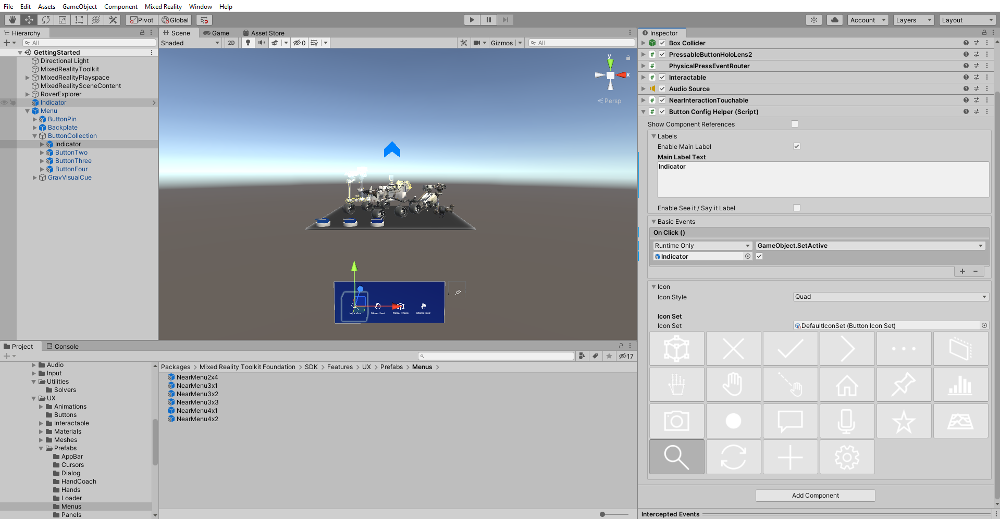

4. To disable the chevron Indicator object, in the Hierarchy window, select the Indicator object that looks like chevron, then in the Inspector window:
    * Uncheck the checkbox next to its name to make it inactive by default
    * Use the Add Component button to add the Directional Indicator Controller (Script) component

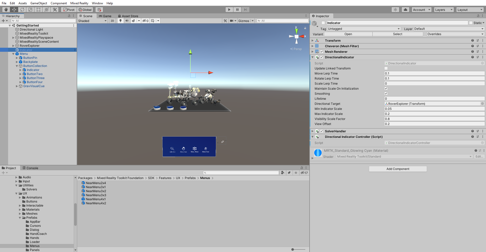

5. Rename the second button to **TapToPlace**, then in the Inspector window, configure the **Button Config Helper (Script)** component as follows:

    * Change the **Main Label Text** to match the name of the button
    * Assign the RoverExplorer > **RoverAssembly** object to the **None (Object)** field
    * From the **No Function** dropdown, select **TapToPlace** > **bool Enabled** to update this property value when the event is triggered
    * Verify that the argument checkbox is **checked**
    * Change the **Icon** to the 'hand with ray' icon

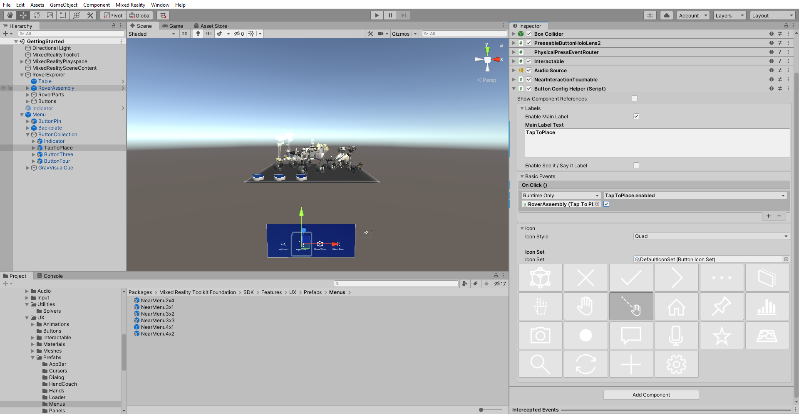

6. In the Hierarchy window, select the RoverAssembly object, then in the Inspector window, configure the Tap To Place (Script) component as follows:
    * Uncheck the checkbox next to its name to make it inactive by default
    * In the On Placing Stopped () event section, click the + icon to add a new event:
    * Assign the RoverExplorer > RoverAssembly object to the None (Object) field
    * From the No Function dropdown, select TapToPlace > bool Enabled to update this property value when the event is triggered
    * Verify that the argument checkbox is unchecked

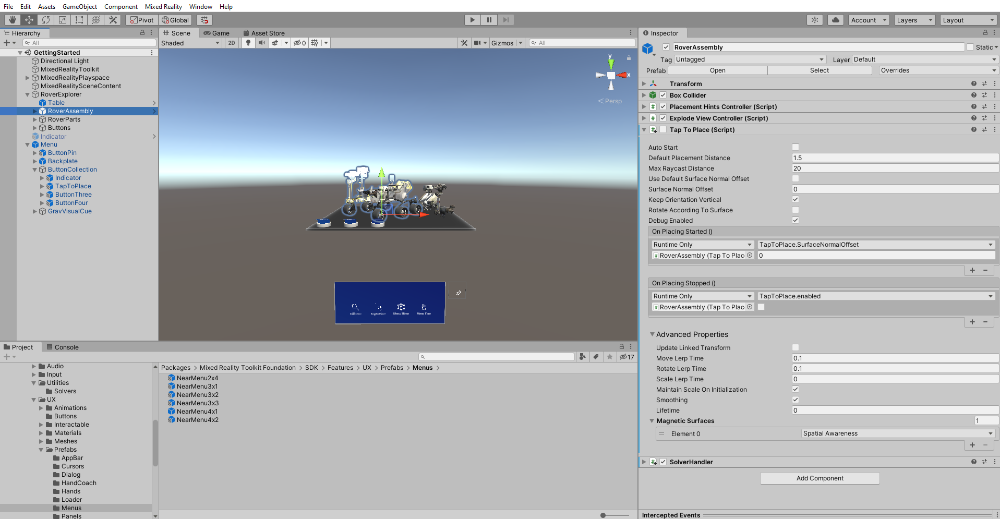

## Adding text to the scene

1. In the Hierarchy window, right-click on the Table object and select 3D Object > Text - TextMeshPro to add a text object as a child of the Table object, then in the Inspector window, configure the Rect Transform component as follows:
    * Change Pos Y to 1
    * Change Width to 1
    * Change Height to 1
    * Change Rotation X to 90

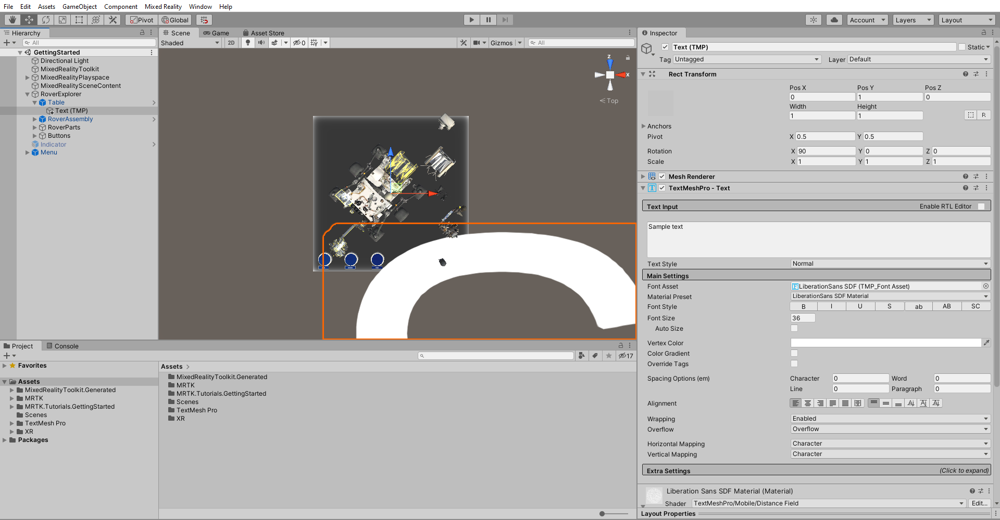

2. Then configure the TextMeshPro - Text component as follows::
    * Change Text to Rover Explorer
    * Change Font Style to Bold
    * Change Font Size to 1
    * Change Extra Settings > Margins to 0.03

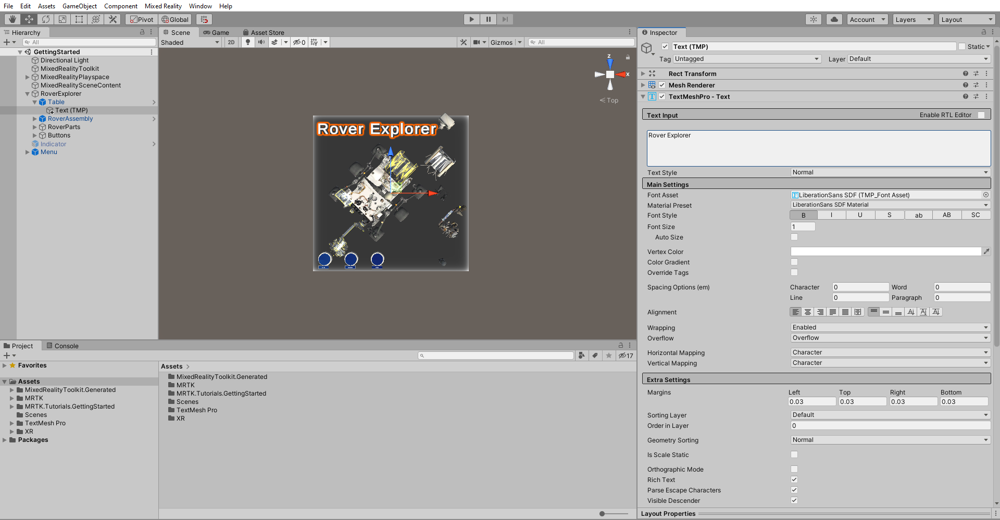

## Adding tooltips

1. In the Project window, navigate to the Packages > Mixed Reality Toolkit Foundation > SDK > Features > UX > Prefabs > ToolTip folder to locate the tooltip prefabs:

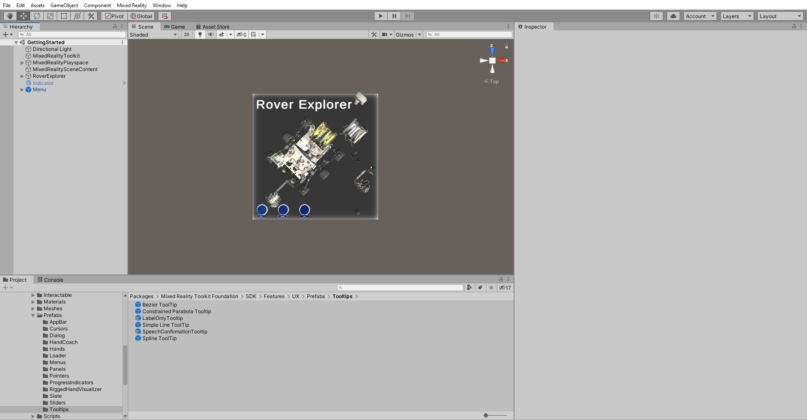

2. In the Hierarchy window, expand the RoverExplorer > RoverParts object and select all its child rover part objects, then in the Inspector window, use the Add Component button to add the ToolTipSpawner component and configure it as follows:
    * Ensure the Focus Enabled checkbox is checked to require the user to look at the part for the tooltip to appear
    * Assign the Simple Line ToolTip prefab from the Project window to the Prefab field
    * Change the ToolTip Override Settings > Settings Mode to Override
    * Change the ToolTip Override Settings > Manual Pivot Local Position Y to 1.5

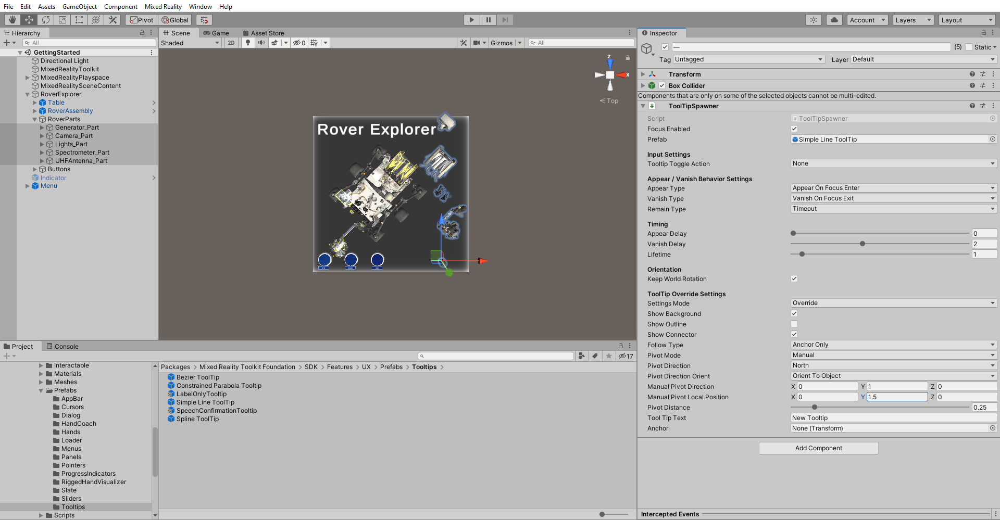

3. In the Hierarchy window, select the first rover part, RoverParts > Camera_Part, and configure the ToolTipSpawner component as follows:
    * Change Tool Tip Text to reflect the name of the part, i.e., Camera

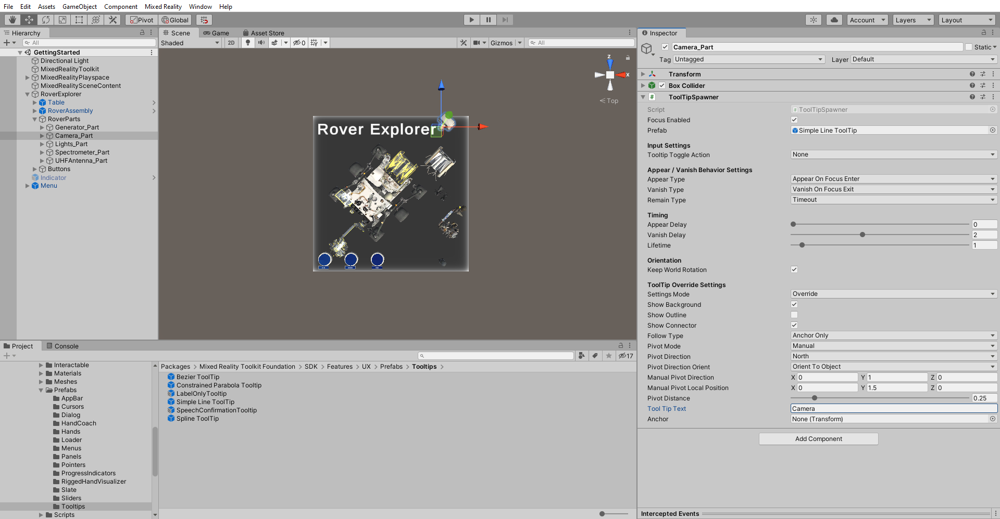

4. Repeat this step for each of the rover part objects to configure the ToolTipSpawner component as follows:
    * For the Generator_Part, change the Tool Tip Text to Generator
    * For the Lights_Part, change the Tool Tip Text to Lights
    * For the UHFAntenna_Part, change the Tool Tip Text to UHF Antenna field
    * For the Spectrometer_Part, change the Tool Tip Text to Spectrometer
    * Press the Play button to enter Game mode, then press-and-hold the right mouse button while moving your mouse until the gaze hit's one of the parts and the tooltip for that part will be displayed:

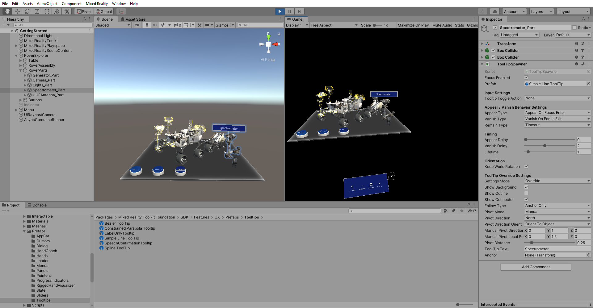

## Manipulating 3D objects

1. Additionally, you will configure the Rover Explorer so that you can place the rover parts on to the Rover to make it a complete rover assembly.In the Hierarchy window, expand the RoverExplorer > RoverParts object and select all its child rover part objects and the RoverAssembly object, then in the Inspector window, use the Add Component button to add the following components to all the selected objects:
    * Object Manipulator (Script) component
    * NearInteractionGrabbable component
    * Part Assembly Controller (Script) component

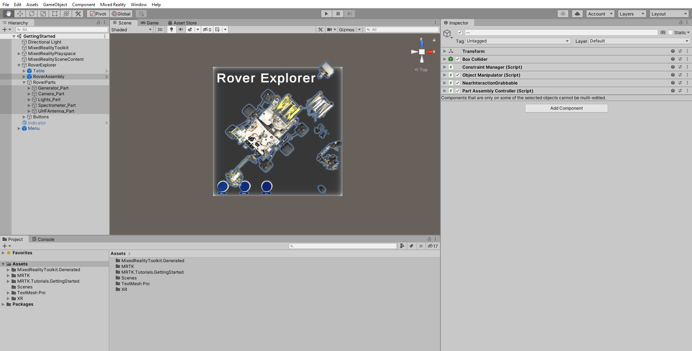

2. With all the rover part objects and the RoverAssembly object still selected, in the Inspector window, configure the Object Manipulator (Script) component as follows:
    * From the Two Handed Manipulation Type dropdown, uncheck the Scale, so only Move and Rotate is enabled

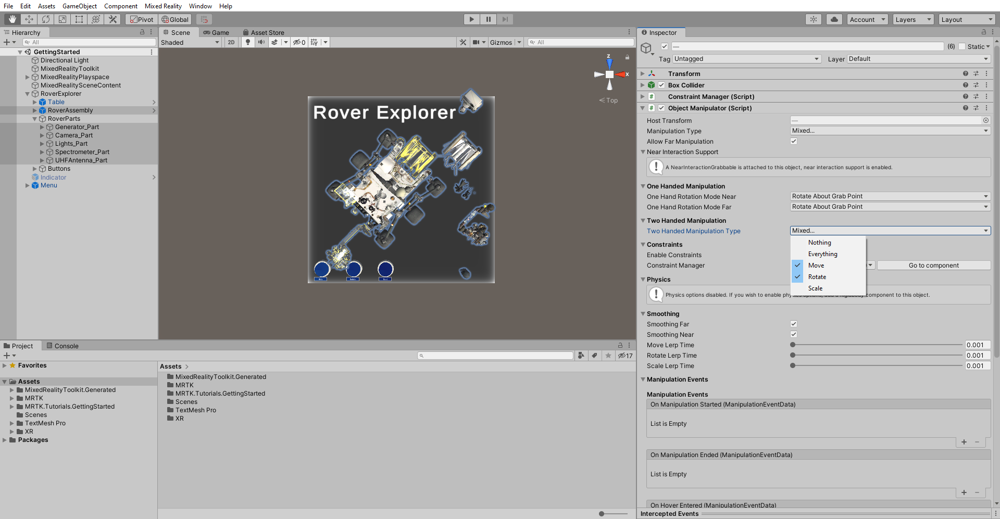

3. In the Project window, navigate to Packages > Mixed Reality Toolkit Standard Assets > Audio folder to locate the audio clips:

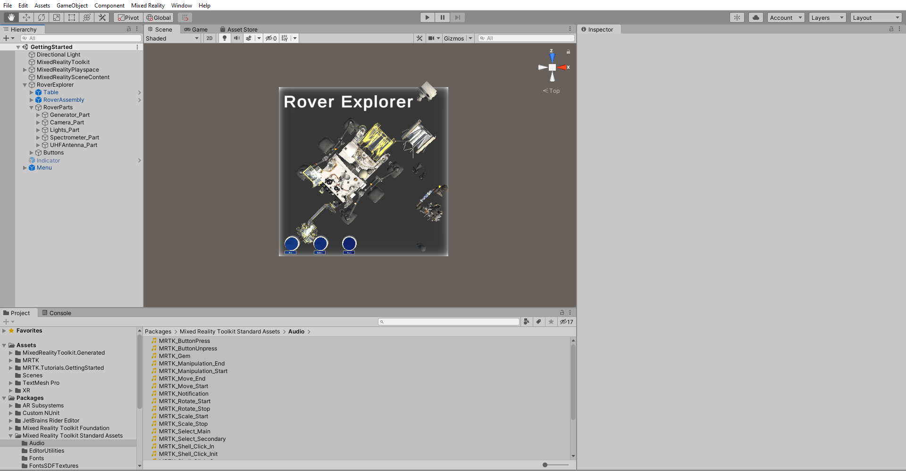

4. In the Hierarchy window, reselect all the rover part objects, then in the Inspector window, use the Add Component button to add the Audio Sources component and configure it as follows:

    * Assign the MRTK_Scale_Start audio clip to the AudioClip field
    * Uncheck the Play On Awake checkbox
    * Change Spatial Blend to 1

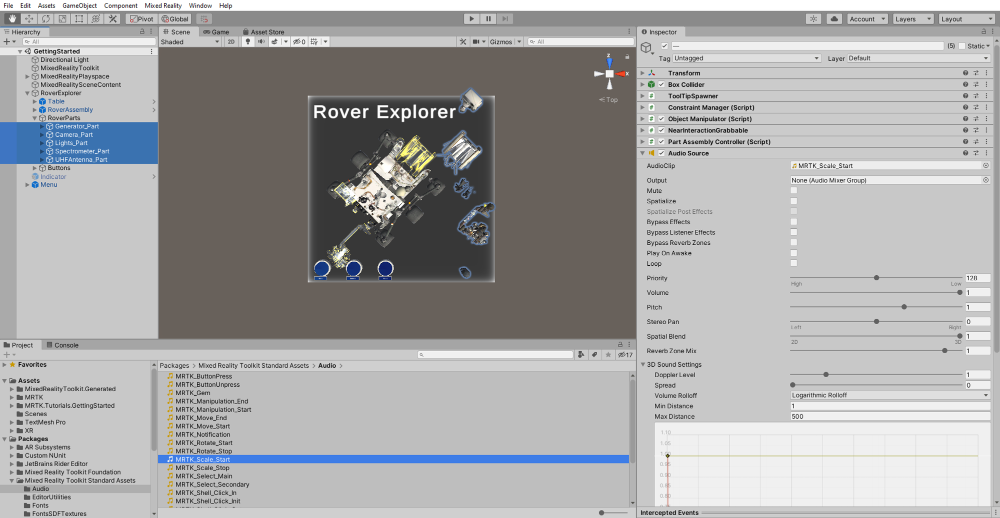

5. In the Hierarchy window, expand the RoverAssembly > RoverModel_PlacementHints_XRay > Parts_PlacementHints object to reveal all of the placement hint objects, then select the first rover part, RoverParts > Camera_Part, and configure the Part Assembly Controller (Script) component as follows:
    * Assign the Camera_PlacementHint object to the Location To Place field

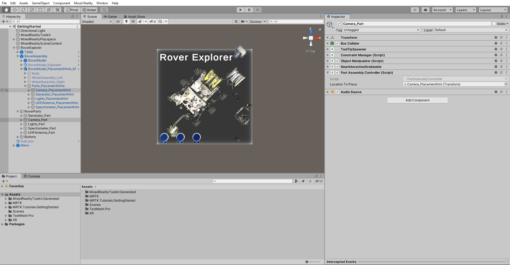

6. Repeat this step for each of the remaining rover part objects and the RoverAssembly object to configure the Part Assembly Controller (Script) component as follows:
    * For the Generator_Part, assign the Generator_PlacementHint object to the Location To Place field
    * For the Lights_Part, assign the Lights_PlacementHint object to the Location To Place field
    * For the UHFAntenna_Part, assign the UHFAntenna_PlacementHint object to the Location To Place field
    * For the Spectrometer_Part, assign the Spectrometer_PlacementHint object to the Location To Place field
    * For the RoverAssembly, assign the object itself, i.e. the same RoverAssembly object, to the Location To Place field

7. In the Hierarchy window, select the RoverExplorer > Buttons > Reset button object, then in the Inspector window, configure the Interactable OnClick () event as follows:
    * Assign the RoverAssembly object to the None (Object) field
    * From the No Function dropdown, select PartAssemblyController > ResetPlacement () to set this function as the action to be executed when the event is triggered

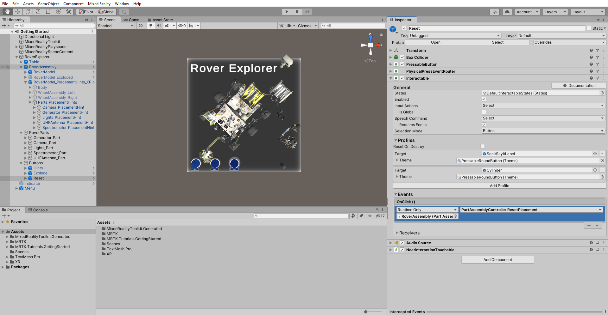

8.	If you now enter Game mode, you can use near or far interaction to place the rover parts on to the Rover. Once the part is close to the corresponding placement hint, it will snap into place and become part of the Rover. To reset the placements, you can press the Reset button:

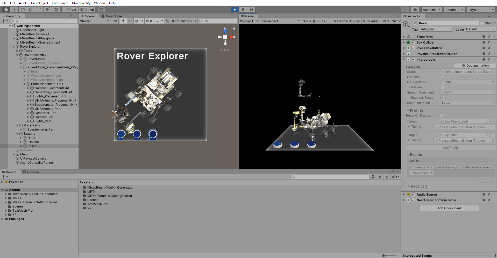

## Adding Bounds Control

1. In the Hierarchy window, select the RoverExplorer object, then in the Inspector window, use the Add Component button to add the following components:
    * BoundsControl component
    * Object Manipulator (Script) component
Then uncheck the checkbox next to all the components to make them disabled by default:

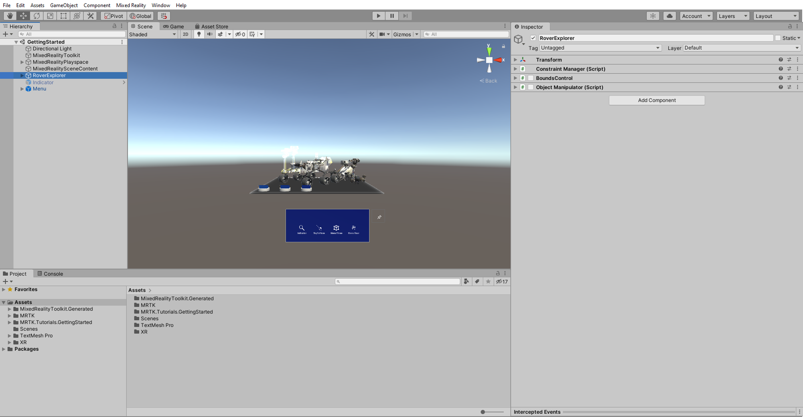

2. In the Hierarchy window, expand the Menu > **ButtonCollection** object to reveal the four buttons and rename the third button to **BoundsControl_Enable**, then in the Inspector window, configure the **Button Config Helper (Script)** component as follows:

    * Change the **Main Label Text** to **Enable**
    * Assign the **RoverExplorer** object to the **None (Object)** field
    * From the **No Function** dropdown, select **BoundsControl** > **bool Enabled** to update this property value when the event is triggered
    * Verify that the argument checkbox is **checked**
    * Click the small **+** icon to add another event
    * Assign the **RoverExplorer** object to the **None (Object)** field
    * From the **No Function** dropdown, select **ObjectManipulator** > **bool Enabled** to update this property value when the event is triggered
    * Verify that the argument checkbox is **checked**
    * Leave the **Icon** as the 'cube with bounds control' icon

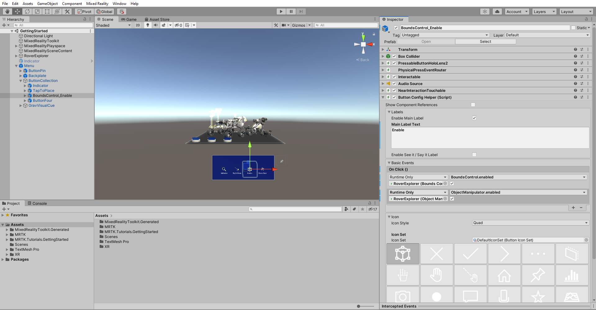

3. Rename the forth and last button to **BoundsControl_Disable**, then in the Inspector window, configure the **Button Config Helper (Script)** component as follows:

    * Change the **Main Label Text** to **Disable**
    * Assign the **RoverExplorer** object to the **None (Object)** field
    * From the **No Function** dropdown, select **BoundsControl** > **bool Enabled** to update this property value when the event is triggered
    * Verify that the argument checkbox is **unchecked**
    * Click the small **+** icon to add another event
    * Assign the **RoverExplorer** object to the **None (Object)** field
    * From the **No Function** dropdown, select **ObjectManipulator** > **bool Enabled** to update this property value when the event is triggered
    * Verify that the argument checkbox is **unchecked**
    * Change the **Icon** to the 'cube with bounds control" icon

4. If you now enter Game mode and enable the Bounds Control by clicking the Enable button, you can use near or far interaction to move, rotate, and scale the Bounds Control, and use the Disable button to disable the Bounds Control again:

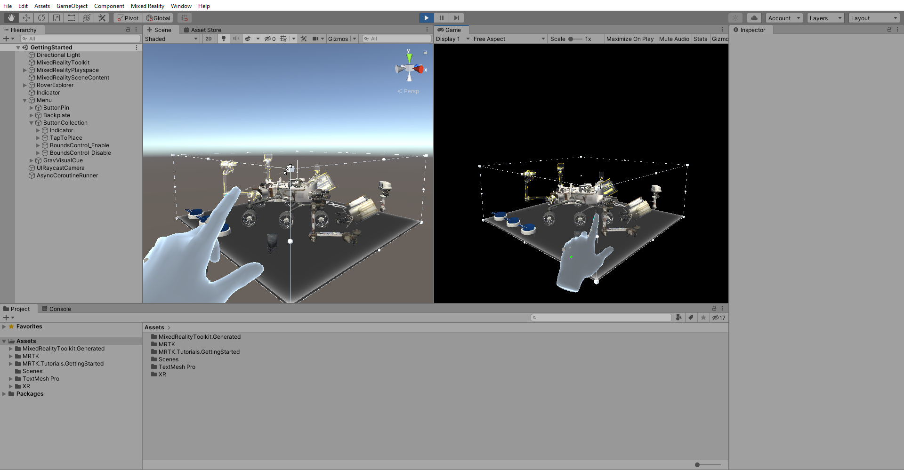