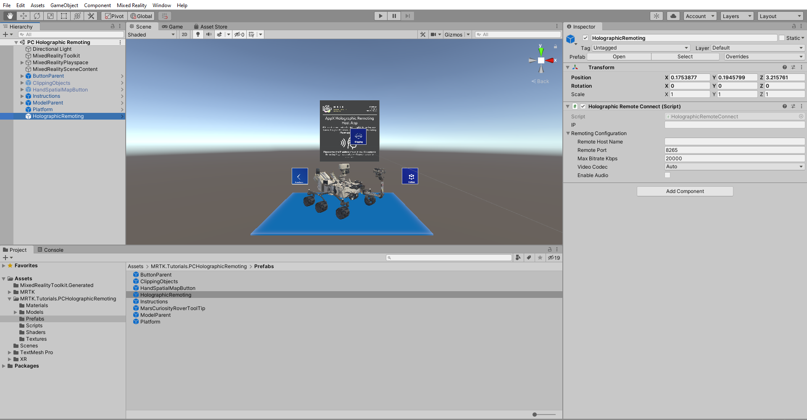
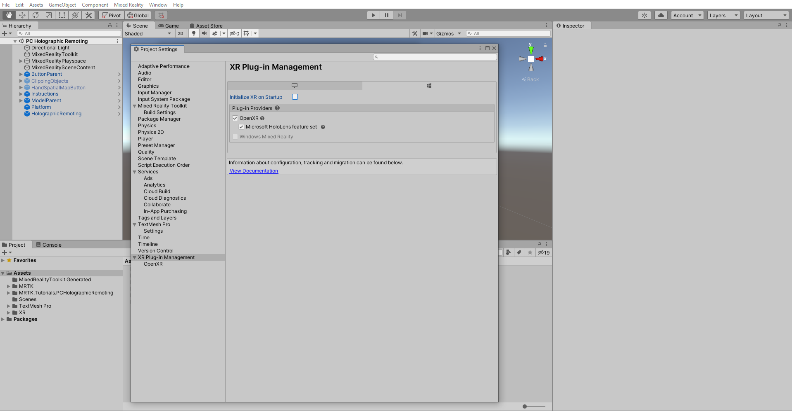
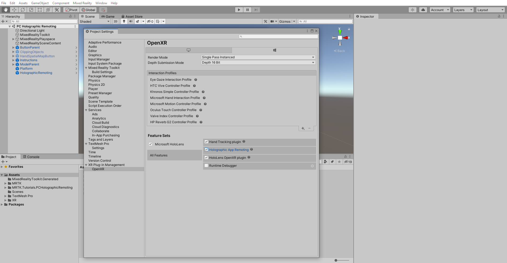
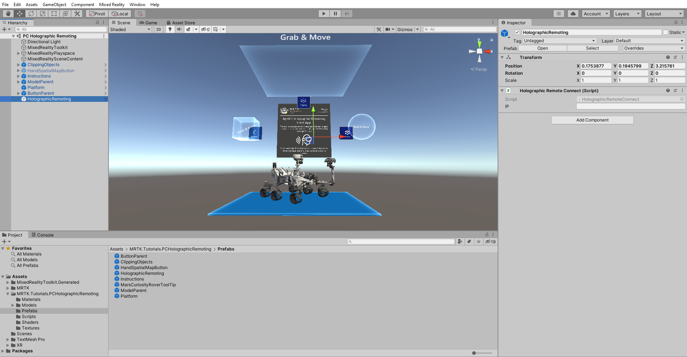

# [Unity 2019/2020 + Windows XR Plugin](#tab/winxr)

# [Unity 2020 + OpenXR](#tab/openxr)

## Configuring your scene for Holographic Remoting

In this section, you will configure your project to stream your Mixed Reality experience to your HoloLens 2 device from your PC in real-time over a Wi-Fi connection.

In the Project window, navigate to the **Assets** > **MRTK.Tutorials.PCHolograhicRemoting** > **Prefabs** folder, and click and drag **HolographicRemoting** prefab into your scene.

## Build your application to PC

Your Holographic Remoting app is now ready to build on your PC. Follow the below steps and make these changes to build this application on to your PC.

### 1. Set the player settings

In **Project Settings** window select **XR Plug-in Management** ensure that you are in UWP platform and uncheck **Initialize XR on Startup**

Next select **XR Plug-in Management** > **OpenXR** and in **ALL Features** tab check the **Holographic App Remoting**

# [Legacy WSA](#tab/wsa)

## Configuring your scene for Holographic Remoting

In this section, you will configure your project to stream your Mixed Reality experience to your HoloLens 2 device from your PC in real-time over a Wi-Fi connection.

In the Project window, navigate to the **Assets** > **MRTK.Tutorials.PCHolograhicRemoting** > **Prefabs** folder, and click and drag **HolographicRemoting** prefab into your scene.

## Build your application to PC

Your Holographic Remoting app is now ready to build on your PC. Follow the below steps and make these changes to build this application on to your PC.

### 1. Set the player settings

In the **XR Settings** section, select the **WSA Holographic Remoting Supported** checkbox and enable the Holographic Remoting.

