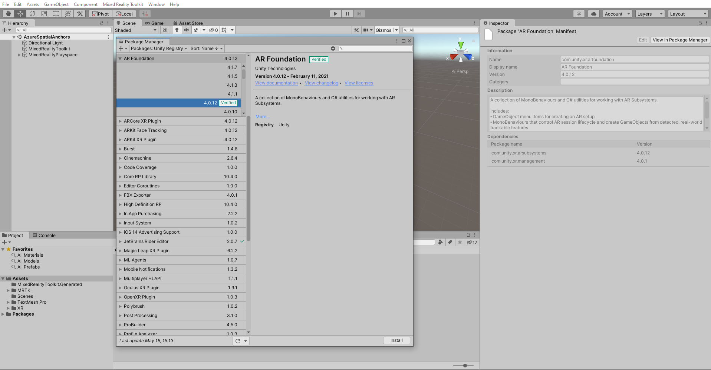
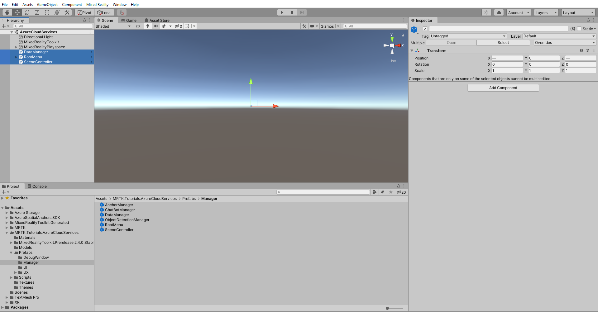
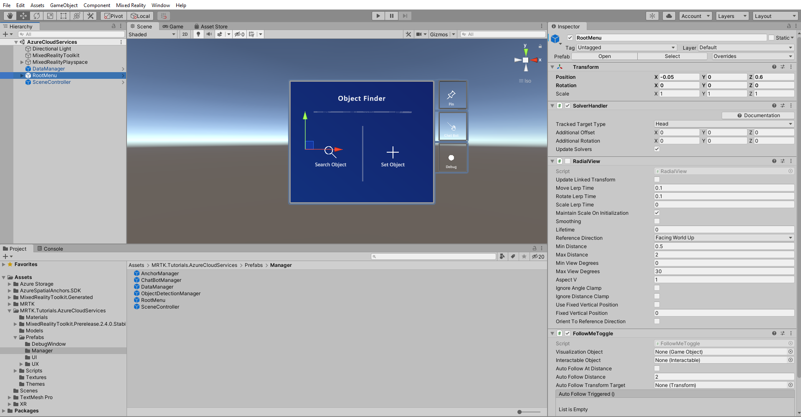
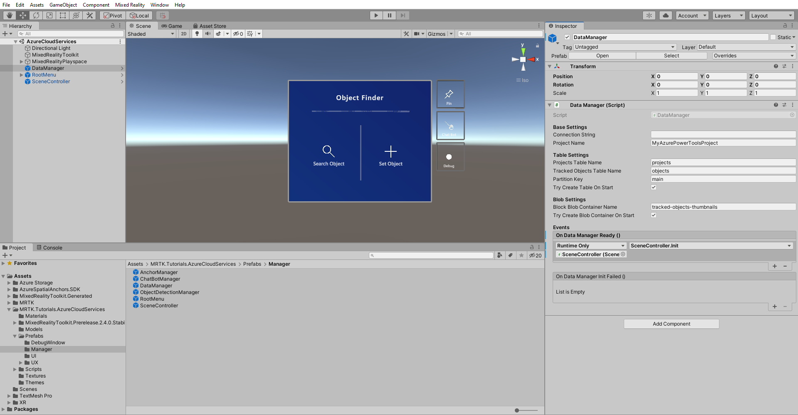
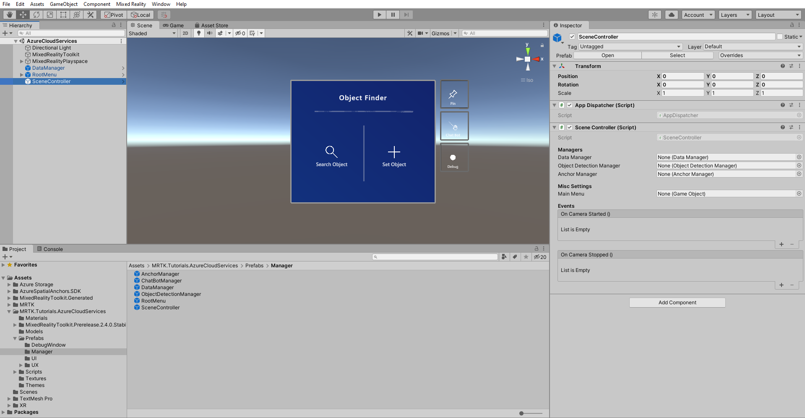
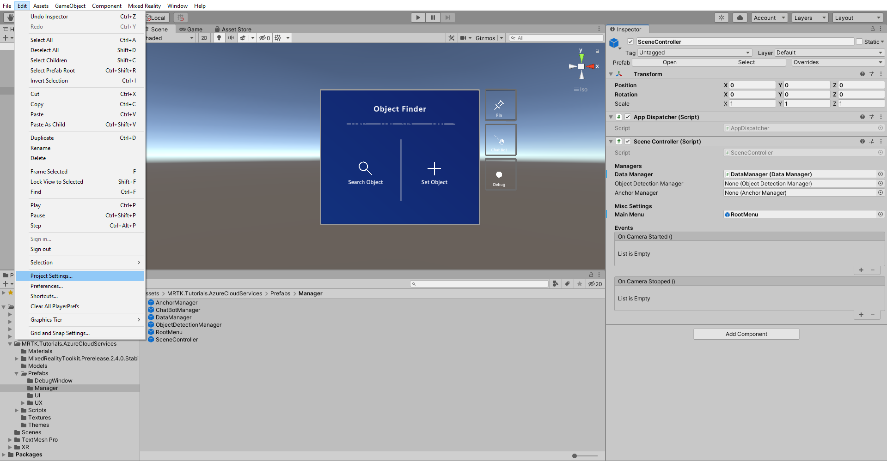
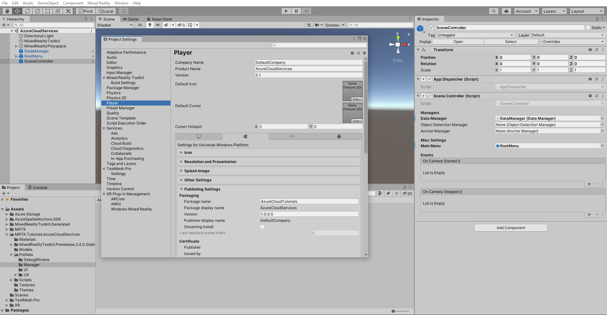
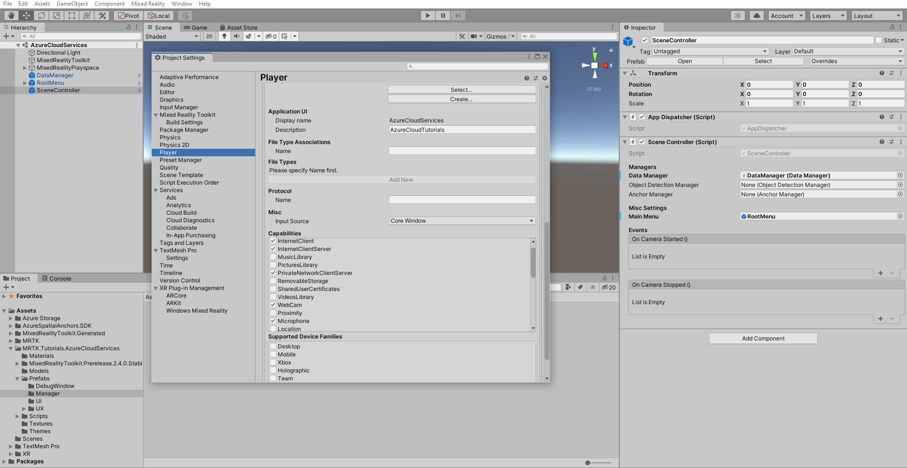

# 1. Azure Cloud Services for HoloLens 2

Welcome to this series of tutorials focused on bringing **Azure Cloud** services into a **HoloLens 2** application. In this five-part tutorial series, you will learn how to integrate several **Azure Cloud** services into a **Unity** project for **HoloLens 2**. With each consecutive chapter, you will add new **Azure Cloud** services to expand the application features and user experience, while teaching you the fundamentals of each **Azure Cloud** service.

> [!NOTE]
> This tutorial series will focus on the **HoloLens 2** but due the cross-platform nature of Unity, most of your learnings will also apply for Desktop and Smartphone applications.

In this first tutorial, you'll be introduced to the goals of the series and each Azure Cloud service you'll be using, as well as setting up the initial Unity project.

In the second tutorial, [Integrating Azure Storage](mr-learning-azure-02.md), you'll start off by integrating Azure Storage as the persistence solution for the demo application. You'll also learn the differences between Blob Storage and Table Storage, prepare the needed project resources, setup the scene. Finally, you'll learn how to verify the read, update, and delete data operations.

Continuing with the third tutorial, [Integrating Azure Custom Vision](mr-learning-azure-03.md), you will use Azure Custom Vision to train and detect images in the HoloLens 2 application. The chapter starts off with setting up your own Azure Custom Vision resource, preparing the scene components and getting into action by training and detecting your own images from inside the application.

Next you advance in the fourth tutorial, [Integrating Azure Spatial Anchors](mr-learning-azure-04.md), with exploring Azure Spatial Anchors service to save and find locations, learn the core concepts, prepare necessary resources, setup the scene and start using the new feature in the application.

With the fifth tutorial, [Integrating Azure Bot Service with LUIS](mr-learning-azure-05.md), you finalize by giving the application a new method of user interaction: natural language! This feature will be realized by using the Azure Bot Framework together with Language Understanding (LUIS). This final chapter teaches you the basics of Azure Bot Service and to speed up the process you will be using the Bot Framework Composer as a zero code solution. Once the bot is created, you will integrate it into the scene and give it a run with the final stage of the HoloLens 2 application.

## Application goals

In this tutorial series, you will build a **HoloLens 2** application that can detect objects from images and find its spatial location. To set a domain language, you call such entities from now **Tracked Object**.
The user can create a **Tracked Object** to either or both associate a set of images via computer vision and/or a spatial location. All data must be persisted into the cloud. Furthermore some aspects of the application will be optionally controlled by natural language assisted through a bot.

### Features

* Basic managing of data and images
* Image training and detection
* Storing a spatial location and guidance to it
* Bot assistant to use some features via natural language

## Azure Cloud services

You'll use the following **Azure Cloud** services to implement the above features:

### Azure Storage

You will use [Azure Storage](https://azure.microsoft.com/services/storage/) for the persistence solution. It allows you to store data on a table and upload large binaries like images.

### Azure Custom Vision

With [Azure Custom Vision](https://azure.microsoft.com/services/cognitive-services/custom-vision-service/) (part of the [Azure Cognitive Services](https://azure.microsoft.com/services/cognitive-services/)) you can associate to *Tracked Objects* a set of images, train a machine learning model on the set and detect the *Tracked Object*.

### Azure Spatial Anchors

To store a *Tracked Object* location and give a guided directions to find it, you use [Azure Spatial Anchors](https://azure.microsoft.com/services/spatial-anchors/).

### Azure Bot Service

The application is mainly driven by traditional UI, so you use the [Azure Bot Service](https://azure.microsoft.com/services/bot-service/) to add some personality and act as a new interaction method.

## Prerequisites

>[!TIP]
>If you have not completed the [Getting started tutorials](mr-learning-base-01.md) series yet, it's recommended that you complete those tutorials first.

* A Windows 10 PC configured with the correct [tools installed](../../install-the-tools.md)
* Windows 10 SDK 10.0.18362.0 or later
* Some basic C# programming ability
* A HoloLens 2 device [configured for development](../../platform-capabilities-and-apis/using-visual-studio.md#enabling-developer-mode)
* A connected webcam if you like to test from Unity editor
* <a href="https://docs.unity3d.com/Manual/GettingStartedInstallingHub.html" target="_blank">Unity Hub</a> with Unity 2020/2019 LTS installed and the Universal Windows Platform Build Support module added

> [!Important]
> This tutorial series supports Unity 2020 LTS(currently 2020.3.x) if you are using Open XR or Windows XR Plugin and also Unity 2019 LTS (currently 2019.4.x) if you are using Legacy WSA or Windows XR Plugin. This supersedes any Unity version requirements stated in the prerequisites linked above.

## Creating and preparing the Unity project

In this section, you will create a new Unity project and get it ready for MRTK development.

First, follow the [Initializing your project and first application](mr-learning-base-02.md), excluding the [Build your application to your device](mr-learning-base-02.md#building-your-application-to-your-hololens-2) instructions, which includes the following steps:

1. [Creating the Unity project](mr-learning-base-02.md#creating-the-unity-project) and give it a suitable name, for example, *Azure Cloud Tutorials*
2. [Switching the build platform](mr-learning-base-02.md#switching-the-build-platform)
3. [Importing the TextMeshPro Essential Resources](mr-learning-base-02.md#importing-the-textmeshpro-essential-resources)
4. [Importing the Mixed Reality Toolkit and Configuring the Unity project](mr-learning-base-02.md#importing-the-mixed-reality-toolkit-and-configuring-the-unity-project)
5. [Creating and configuring the scene](mr-learning-base-02.md#creating-the-scene-and-configuring-mrtk) and give the scene a suitable name, for example, *AzureCloudServices*

Then follow the [Changing the Spatial Awareness Display Option](mr-learning-base-03.md#changing-the-spatial-awareness-display-option) instructions to ensure the MRTK configuration profile for your scene is **DefaultXRSDKConfigurationProfile** and change the display options for the spatial awareness mesh to **Occlusion**.

## Installing inbuilt Unity packages

In the Unity menu, select **Window** > **Package Manager** to open the Package Manager window, then select **AR Foundation** and click the **Install** button to install the package:

> [!NOTE]
> You are installing the AR Foundation package because the Azure Spatial Anchors SDK requires it, which you will import in the next section.

## Importing the tutorial assets

Add AzurespatialAnchors SDK V2.7.1 into your unity project, to add the packages please follow this [tutorial](/azure/spatial-anchors/how-tos/setup-unity-project?tabs=UPMPackage)

Download and **import** the following Unity custom packages **in the order they are listed**:

* [AzureStorageForUnity.unitypackage](https://github.com/microsoft/MixedRealityLearning/releases/download/azure-cloud-services-v2.4.0/AzureStorageForUnity.unitypackage)
* [MRTK.Tutorials.AzureCloudServices.unitypackage](https://github.com/microsoft/MixedRealityLearning/releases/download/azure-cloud-services-v2.4.0/MRTK.Tutorials.AzureCloudServices.unitypackage)

> [!TIP]
> For a reminder on how to import a Unity custom package, you can refer to the [Importing the tutorial assets](mr-learning-base-02.md#importing-the-tutorial-assets) instructions.

After you have imported the tutorial assets your Project window should look similar to this:

> [!NOTE]
> If you see any CS0618 warnings regarding 'WorldAnchor.SetNativeSpatialAnchorPtr(IntPtr)' and 'WorldAnchor.GetNativeSpatialAnchorPtr()' being obsolete, you can ignore these warnings.

## Creating and preparing the scene
<!-- TODO: Consider renaming to 'Preparing the scene' -->

In this section, you will prepare the scene by adding some of the tutorial prefabs.

In the Project window, navigate to **Assets** > **MRTK.Tutorials.AzureCloudServices** > **Prefabs** > **Manager** folder. While holding down the CTRL button, click on **SceneController**, **RootMenu** and **DataManager** to select the three prefabs:

The **SceneController (prefab)** contains two scripts, **SceneController (script)** and **UnityDispatcher (script)**. The **SceneController** script component contains several UX functions and facilitates the photo capture functionality while **UnityDispatcher** is a helper class to allow execute actions on the Unity main thread.

The **RootMenu (prefab)** is the primary UI prefab that holds all UI windows that are connected to each other through various small script components and control the general UX flow of the application.

The **DataManager (prefab)** is responsible for talking to Azure storage and will be explained further in the next tutorial.

Now with the three prefabs still selected, drag them into the Hierarchy window to add them to the scene:

To focus in on the objects in the scene, you can double-click on the **RootMenu** object, and then zoom slightly out again:

> [!TIP]
> If you find the large icons in your scene, for example, the large framed 'T' icons distracting, you can hide these by <a href="https://docs.unity3d.com/2019.1/Documentation/Manual/GizmosMenu.html" target="_blank">toggling the Gizmos</a> to the off position.

## Configuring the scene

In this section, you will connect *SceneManager*, *DataManager* and *RootMenu* together to have a working scene to be ready for the following [Integrating Azure storage](mr-learning-azure-01.md) tutorial.

### Connect the objects

In the Hierarchy window, select the **DataManager** object:

In the Inspector window, locate the **DataManager (Script)** component and you will see an empty slot on the **On Data Manager Ready ()** event. Now from the Hierarchy window drag the **SceneController** object into the **On Data Manager Ready ()** event.

You will notice that the dropdown menu of the event became active, click on the dropdown menu and navigate to **SceneController** and in the sub menu select the **Init ()** option:

From the Hierarchy window, select the **SceneController** object, there in the Inspector you will find the **SceneController** (script) component.

You will see that there are several unpopulated fields, let's change that. Move the **DataManager** object from the Hierarchy into the *Data Manager* field and move the **RootMenu** GameObject from the Hierarchy into the *Main Menu* field.

Now your scene is ready for the upcoming tutorials. Don't forget to save it into your project.

## Prepare project build pipeline

While the project yet has to be filled with content, you have to perform some preparations, so the project is ready for building for **HoloLens 2**.

### 1. Add additional required capabilities

In the Unity menu, select **Edit** > **Project Settings...** to open the Project Settings window:

In the Project Settings window, select **Player** and then **Publishing Settings**:

In the  **Publishing Settings**, scroll down to the **Capabilities** section and double-check that the **InternetClient**, **Microphone** and **SpatialPerception** capabilities, which you enabled when you created the project at the beginning of the tutorial, are enabled. Then, enable the **InternetClientServer**, **PrivateNetworkClientServer**, and **Webcam** capabilities:

### 2. Deploy the app to your HoloLens 2

Not all features that you will use in this tutorial series can run inside the Unity editor, this means that you need to be familiar with deploying the application to your HoloLens 2 device.

> [!TIP]
> For a reminder on how to build and deploy your Unity project to HoloLens 2, you can refer to the [Getting started tutorials - Build your application to your device](mr-learning-base-02.md#building-your-application-to-your-hololens-2) instructions.

### 3. Run the app on your HoloLens 2 and follow the in-app instructions

> [!CAUTION]
> All Azure Services uses the internet, so make sure your device is connected to the internet.

When the application is running on your device, accept access to the following requested capabilities:

* Microphone
* Camera

These capabilities are required for services like *Chat Bot* and *Custom Vision* to function properly.

## Congratulations

In this tutorial, you were introduced to the tutorial series, learned about the features you will implement and how **Azure Cloud** services tie in to making your *HoloLens 2* application happen. You added the required components into the project and prepared the scene for this tutorial series.

In the next lesson, you will use Azure storage as a cloud based persistence solution for storing data and images.

> [!div class="nextstepaction"]
> [Next tutorial: 2. Integrating Azure storage](mr-learning-azure-02.md)