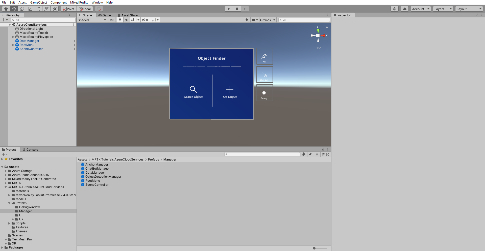
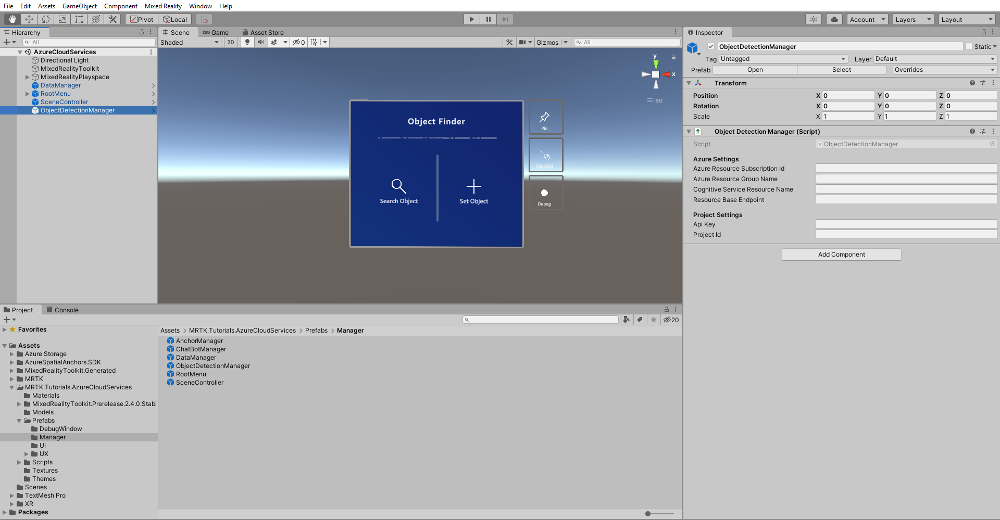
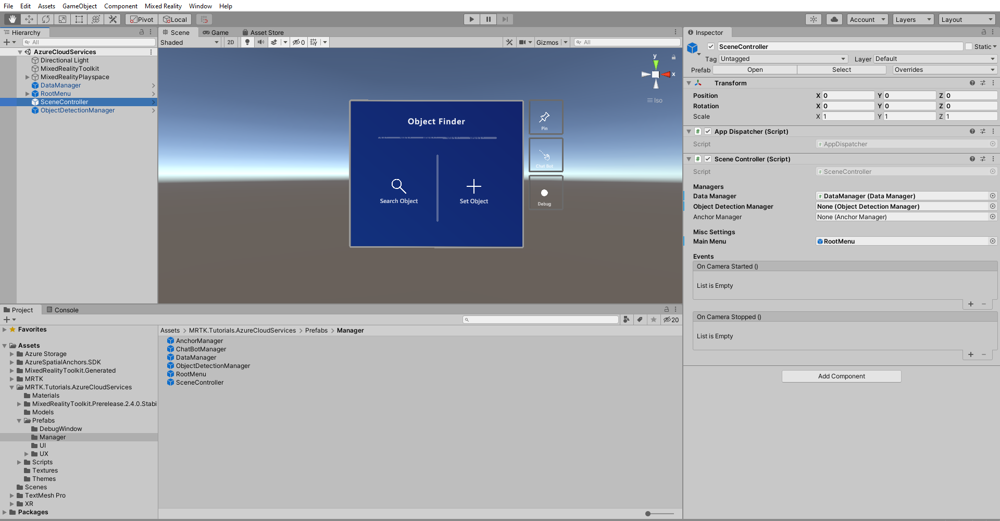

# 3. Integrating Azure Custom Vision

In this tutorial, you will learn how to use **Azure Custom Vision**.You will upload a set of photos to associate it with a *Tracked Object*, upload them to the **Custom Vision** service and start the training process. Then you will use the service to detect the *Tracked Object* by capturing photos from the webcam feed.

## Objectives

* Learn the basics about Azure Custom Vision
* Learn how to setup the scene to use Custom Vision in this project
* Learn how to integrate upload, train and detect images

## Understanding Azure Custom Vision

**Azure Custom Vision** is part of the **Cognitive Services** family and is used to train image classifiers. The image classifier is an AI service that uses the trained model to apply matching tags. This classification feature will be used by our application to detect *Tracked Objects*.

Learn more about [Azure Custom Vision](/azure/cognitive-services/custom-vision-service/home).

## Preparing Azure Custom Vision

Before you can start, you have to create a custom vision project, the fastest way is by using the web portal.

Follow this [quickstart tutorial](/azure/cognitive-services/custom-vision-service/getting-started-build-a-classifier#choose-training-images) to setup your account and project until section *Upload and tag images*.

> [!WARNING]
> To train a model you need to have at least 2 tags and 5 images per tag. To use this application you should at least create one tag with 5 images, so that the training process later won't fail.

## Preparing the scene

In the Project window, navigate to the **Assets** > **MRTK.Tutorials.AzureCloudServices** > **Prefabs** > **Manager** folder.

From there drag the prefab **ObjectDetectionManager** into the scene Hierarchy.

In the Hierarchy window locate the **ObjectDetectionManager** object and select it.
The **ObjectDetectionManager** prefab contains the **ObjectDetectionManager (script)** component and as you can see from the Inspector window it depends on Azure settings and Project settings.

## Retrieving Azure api resource credentials

The necessary credentials for the **ObjectDetectionManager (script)** settings can be retrieve from the Azure Portal and the custom vision portal.

### Retrieving Azure Settings credentials

Find and locate the custom vision resource of type **Cognitive Services** you have created in the *Preparing the scene* section of this tutorial (select custom vision resources name followed by *-Prediction* ). There click on *Overview* or *Keys and Endpoint* to retrieve the necessary credentials.

### Retrieving Project Settings credentials

In the [custom vision](https://www.customvision.ai/projects) dashboard, open the project you have created for this tutorial and click on the top right corner of the page on the gear icon to open the settings page. Here on the right hand *Resources* section you will find the necessary credentials.

Now with the **ObjectDetectionManager (script)** setup correctly, find the **SceneController** object in your scene Hierarchy and select it.

You see *Object Detection Manager* field in the **SceneController** component is empty, drag the **ObjectDetectionManager** from the Hierarchy into that field and save the scene.

## Take and upload images

Run the scene and click on **Set Object**, type in the name for one of the **Tracked Objects** you have created in the [previous lesson](mr-learning-azure-02.md). Now click on **Computer Vision** button you can find at the bottom of the **Object Card**.

A new window will open where you have to take six photos to train the model for image recognition. Click on the **Camera** button and perform an AirTap when you look on the object you like to track, do this six times.

> [!TIP]
> To improve the model training try to take each image from different angles and lighting conditions.

Once you have enough images click on the **Train** button to start the model training process in the cloud. Activating the training will upload all images and then start the training, this can take up to a minute or more. A message inside the menu indicates the current progress and once it indicates the completion you can stop the application

> [!TIP]
> The **ObjectDetectionManager (script)** directly uploads taken images into the Custom Vision service. As an alternative the custom vision API accepts URLs to the images, as an exercise you can modify the **ObjectDetectionManager (script)** to upload the images to a Blob storage instead.

## Detect objects

You can now put the trained model to the test, run the application and from the *main menu* click on **Search Object** and type the name of the **Tracked Object** in question. The **Object Card** will appear and click on the **Custom Vision** button. From here the **ObjectDetectionManager** will start taking image captures in the background from the camera and the progress will be indicated on the menu. Point the camera to the object you used to train the model and you will see that after a short while it will detect the object.

## Congratulations

In this tutorial you learned how Azure Custom Vision can be used to train images and use the classification service to detect images that match the associated **Tracked Object**.

In the next tutorial you will learn how to use Azure Spatial Anchors to link a *Tracked Object* with a location in the physical world and how to display an arrow that will guide the user back to the Tracked Object's linked location.

> [!div class="nextstepaction"]
> [Next tutorial: 4. Integrating Azure Spatial Anchors](mr-learning-azure-04.md)